# ASTRAEON ONLINE — Master Gameplay Backbone + Patch Roadmap (Agent Core)

**Version:** v0.4 — Full Backbone / Audit Integration / Release Roadmap  
**Status:** Ready for team discussion, domain modeling, and gameplay-backbone implementation  
**Scope:** Current-patch core systems: character progression, combat, classes, itemization, economy, dungeons, PvP/GvG, world systems, and recommended engineering architecture

> This document consolidates the systems already agreed upon and fills the structural gaps required for implementation: primary-to-derived stat mapping, damage-resolution order, equipment/armor logic, Skill Scroll rules, role detection, and recommended data-domain boundaries.
>
> Additions made for coherence should be treated as a **recommended baseline**. Exact numbers remain tunable without changing the architecture.

---

# 0. Agent Operating Contract

This document is intended to be handed directly to implementation agents. The agent must treat it as a **system contract**, not as a suggestion list.

## 0.1 Source-of-Truth Rules

1. Preserve the existing ASTRAEON project identity and current playable work. Do not rewrite the engine or replace the world pipeline unless a task explicitly requires it.
2. Gameplay systems must be **data-driven**. Values such as damage coefficients, EXP curves, enhancement chances, drop rates, class scaling, skill ranks, cooldowns, and status durations must live in configuration/data rather than being scattered as hard-coded constants.
3. Build new systems behind stable interfaces so later classes/content can reuse them.
4. Implement the **minimum complete version** of the current patch. Do not pull future-patch features forward unless they are required as schema/interface foundations.
5. A future system may be represented by dormant schema fields or extension points, but it must not add visible complexity, UI, save bloat, or runtime cost before its patch.
6. Tests are evidence of correctness, not proof of game quality. A system is not accepted if it technically passes tests but feels bad, is unreadable, or breaks the intended gameplay loop.
7. Preserve save compatibility wherever practical. All persistent schemas must carry explicit versions and migration paths.
8. Separate:
   - definition/static data,
   - runtime state,
   - persistent player state,
   - presentation/UI state.
9. Never let UI become the authoritative owner of gameplay state.
10. Server-authoritative architecture is the long-term target for economy, trading, competitive play, progression, and anti-cheat. Early local prototypes may simulate authority, but APIs/state boundaries must not make a future authoritative service impossible.

## 0.2 Browser / Device Constraints

ASTRAEON is browser-first and must remain practical on mobile, tablet, and PC.

- Avoid systems that require dozens of simultaneous buttons.
- Preserve the 8-slot Action Loadout rule.
- Touch interaction must remain first-class.
- Do not make combat depend on fighting-game precision, frame-perfect cancels, or constant universal dodge spam.
- Performance-heavy systems must be profiled before being expanded.
- Large-scale systems such as 50v50 GvG must be architected with replication/visibility budgets in mind even before networking is complete.

## 0.3 Implementation Priority

When requirements conflict, use this order:

1. Correct core gameplay loop
2. Player-readable behavior
3. Data integrity / save integrity
4. Build/class identity
5. Combat feel
6. Economy integrity
7. Mobile usability
8. Performance
9. Extensibility
10. Cosmetic polish

## 0.4 Do Not Invent Core Rules Silently

If a missing value can be safely data-driven, add a documented **recommended default** and mark it tunable.

If a missing rule would fundamentally alter progression, monetization, class identity, tradeability, PvP fairness, or economy balance, do not silently redesign it. Add a `TBD`/decision note and preserve the backbone.

## 0.5 Patch Discipline

Every patch below has:

- **Goal** — what that patch proves.
- **Start With** — dependency order.
- **Must Ship** — systems/content required to call the patch complete.
- **Schema Ready** — future hooks allowed now.
- **Do Not Build Yet** — explicit scope guard.
- **Exit Gate** — measurable acceptance criteria.

An agent must not call a patch complete until its Exit Gate is met.

---

# 1. Executive Summary

ASTRAEON ONLINE is a browser-first action MMORPG built around a **map-based world, real-time combat, deep buildcraft, and a player-driven economy**. Its world supports multiple power paradigms—Martial/Qi, Arcane/Magic, Spirit, Divine, Psionic, Technology, Void—without making any paradigm inherently superior.

The combat target is not a pure action game based on universal dodge invulnerability or animation-cancel execution. It is an **MMORPG/action hybrid** in which survival comes from positioning, class mobility, Guard, Block, Parry, Barrier, healing, threat management, crowd control, and reading telegraphs.

Characters begin as Base Classes and advance through a separate Base Level / Job Level progression system. Skill Trees use prerequisites, multiple skill ranks, permanent learned passives, and a limited 8-slot Action Loadout that forces real build decisions.

The current patch caps progression at **Base Lv.110 / Advanced Job Lv.50**. There is no Paragon-style infinite level system. Endgame progression shifts to **gear, enhancement, Rune, Module, Relic, build refinement, economy, PvP, GvG, guild systems, and rare chase drops**.

Monetization is designed around **convenience, acceleration, experimentation freedom, and cosmetics**, not exclusive power. F2P players must be able to reach the same power ceiling, although more slowly.

---

# 2. Design Pillars

## 2.1 Build Freedom With Real Opportunity Cost

The system should support unconventional builds, for example:

- Archer builds centered on Basic Attack, CRIT, and ASPD
- Battle Mage using Sword + Orb or Mage Dagger
- Martial using ranged Qi techniques while holding a sword
- Aegis Knight running a Holy Support build without a shield
- Blacksmith wielding many weapon categories because of broad weapon knowledge
- Voidborn Disruptor using Decoys, Phase Shift, and zone control rather than true invisibility

Freedom is constrained through Skill Point scarcity, Action Slot limits, equipment requirements, weapon proficiency, cooldowns, resource costs, and respec cost.

## 2.2 Class Identity Must Come From Gameplay

Roles are not hard-coded by class name.

- A Tank does not need to be a Swordsman
- Matchmaking evaluates Build + Loadout + Stats + Equipment
- Support utility is distributed across multiple paradigms
- Auto Battle is intentionally prevented from replacing skilled/manual endgame play

## 2.3 Economy Is a Gameplay Layer

Blacksmith, Alchemist, Engineer, and Mage Scribing are production/economy systems with real player-to-player value.

## 2.4 Endgame Is Not Infinite Level Grinding

Level progression stops. The game then shifts into itemization, buildcraft, economy, group content, and competition.

---

# 3. Core Gameplay Loop

1. Prepare in town: equipment, build, consumables, contracts/quests
2. Enter fields for Base EXP, Job EXP, currency, Monster Boxes, materials, and knowledge
3. Use Auto Battle only for ordinary field farming
4. Return to town to open boxes, trade, buy Scrolls, enhance, repair, craft, and manage storage
5. Enter manual-content layers: Dungeon, World Boss, PvP, GvG, Guild activities
6. Obtain rare gear, Runes, Modules, Relics, currencies, and cosmetics
7. Refine build/equipment/economic position
8. Repeat at higher content tiers

Towns must therefore be functional social/economic hubs rather than decorative menu spaces.

---

# 4. Character Progression

## 4.1 Base Level and Job Level

Two progression tracks run in parallel:

- **Base Level** = core character growth, Stat Points, content/equipment gating
- **Job Level** = Skill Points for the current class tier

### Base Class Phase

- Base Level cap before advancement: **Lv.60**
- Base Job cap: **Job Lv.50**
- Approximate advancement requirement: `Lv.60 / Job 50`

### Advanced Class Phase

After advancement:

- Base Level remains Lv.60 and continues to **Lv.110**
- Base Job progression ends
- Advanced Job begins at **Adv Job Lv.1**
- Advanced Job cap: **Lv.50**

Current-patch end cap:

`Base Lv.110 / Advanced Job Lv.50`

## 4.2 EXP Curves

- Activities can grant Base EXP and Job EXP simultaneously
- Each uses its own curve
- EXP earned after cap is discarded
- No overflow EXP, banking, or Paragon conversion

## 4.3 Expansion Rule

Future major cap increases should unlock **both a new Base Level cap and a new class tier**, rather than extending level numbers alone.

---

# 5. Primary and Derived Stats

Primary Stats:

- STR
- AGI
- VIT
- INT
- DEX
- LUK

Qi, Psi, Tech, etc. are not Primary Stats. They are class/resource/paradigm systems.

## 5.1 Recommended Global Baseline

| Stat | Primary Effect | Recommended Secondary Effect |
|---|---|---|
| STR | Physical ATK, melee scaling | Carry Weight, minor physical impact/stagger contribution |
| AGI | ASPD, FLEE | Slight action recovery / movement responsiveness |
| VIT | Max HP, DEF contribution | Minor physical-status/flinch resistance, secondary Carry Weight |
| INT | MATK, Max SP | MDEF contribution, SP regen / magical efficiency |
| DEX | HIT, cast-time reduction | Ranged/class-specific ATK conversion, accuracy mechanics |
| LUK | CRIT | Small Perfect Dodge contribution, selected proc/status-luck hooks |

Global formulas should follow:

- **ATK** = Weapon/Base ATK + STR baseline + class/passive conversions
- **MATK** = Weapon/Base MATK + INT baseline + class/passive conversions

Examples of class conversions:

- Archer may convert DEX into additional ATK
- Physical Engineer may convert part of INT into ATK
- Some Mage builds may convert DEX into MATK
- Martial may support STR-driven or INT-driven paths

This creates a **Global Baseline + Class-Specific Conversion** model.

## 5.2 DEF / MDEF / Resistance

- **DEF** mitigates Physical/ATK-tagged damage
- **MDEF** mitigates Magical/MATK-tagged damage
- **Resistance** is an additional layer for elemental/special mitigation from gear, buffs, status effects, and encounter mechanics
- Qi/Psi/Tech do not require dedicated defense stats; their skills still resolve through ATK or MATK and then apply paradigm/element tags

Recommended stat contribution:

- VIT contributes some DEF, but Armor/Gear remains the primary source
- INT contributes some MDEF, but Gear/Robe/Effects remain the primary source

This prevents raw stat allocation from replacing itemization.

## 5.3 HIT / FLEE / CRIT / Perfect Dodge

- HIT: primarily DEX + level/class coefficient
- FLEE: primarily AGI + level/class coefficient
- CRIT: primarily LUK + gear/passives
- Perfect Dodge: separate stat checked after a successful HIT/FLEE result
- LUK may contribute slightly, while gear/passives remain the primary source

Recommended resolution order:

1. Validate skill state/range/target
2. Resolve HIT vs FLEE if the skill uses accuracy
3. If missed, stop
4. Resolve Perfect Dodge
5. If Perfect Dodged, damage = 0 and relevant triggers fire
6. Calculate normal raw damage
7. Resolve Crit behavior
8. Apply DEF/MDEF/Penetration/Resistance
9. Apply Shield/Guard/Block/Parry/mitigation
10. Apply damage + flinch/status/on-hit effects

## 5.4 Critical

Critical behavior can differ by class/build.

Baseline normal Crit:

- guaranteed hit against HIT/FLEE
- still subject to Perfect Dodge
- ignores roughly 30% DEF as a conceptual baseline
- Crit multiplier is class/build dependent rather than universal

Some builds may reinterpret successful CRIT rolls as another trigger, such as Perfect Penetration, instead of using a standard critical multiplier.

## 5.5 Penetration

Supported forms:

- DEF Pen
- MDEF Pen
- Resistance Pen

Penetration should remain rare, limited, and relatively low-cap so Tanks remain viable, especially in PvP/GvG.

---

# 6. Resources

## 6.1 SP

SP is the universal base resource.

## 6.2 Identity Resources

Classes/builds may add resources such as:

- Qi
- Rage
- Focus
- Heat
- Charge
- Spirit Gauge

Skills may generate, consume, or require both SP and an Identity Resource.

Identity Resources come from class mastery/passives, not directly from Primary Stats.

---

# 7. Skill System

## 7.1 Skill Trees

- Skill Points come from Job Levels
- Skill Trees use prerequisites
- Active and Passive skills both exist
- Learned Passives are always active and do not occupy slots
- Skills have multiple ranks
- Max rank varies by skill
- Higher ranks may require higher Job Levels

## 7.2 Skill Point Scarcity

Players cannot max every skill/passive. Build commitment is intentional.

## 7.3 Base vs Advanced Point Pools

- Base Job Skill Points can only be spent in the Base Tree
- Advanced Job Skill Points can only be spent in the Advanced Tree
- Advanced Skills do not require Base Skills as prerequisites
- Advanced Trees may have their own internal prerequisites

## 7.4 Advancement Reset

On Advanced Class change:

- Free Stat Reset
- Base Skill Tree resets to zero
- All Base Skill Points are refunded
- Player rebuilds the Base Tree to match the chosen Advanced Class
- Base Skill progression is then capped; Advanced Job does not add Base points

Later resets use Reset Items.

## 7.5 Reset Items

A Skill Reset Item allows the player to choose:

- Reset Advanced Tree only
- Reset Base + Advanced Trees

If resetting both:

1. Complete the Base Tree first
2. Spend the required Base pool
3. Then unlock Advanced Tree allocation

Respec economy:

- Immediate option via Premium/real-money convenience
- Slow in-game acquisition for F2P
- Tradeable through the Central Market

---

# 8. Action Loadout

Players have:

- **8 Action Slots**
- Separate Basic Attack
- Separate Potion slot

Action Slots may contain:

- Active Skill
- Weapon/Weapon Set for in-combat swapping
- Skill Scroll
- Teleport/Utility Scroll
- Usable Combat Item

## 8.1 In-Combat Loadout Changes

Loadout changes are allowed during combat, but any change places **all Action Slots on cooldown**.

This prevents cooldown bypass and preserves the meaning of the 8-slot limit.

## 8.2 Presets

Multiple presets may be saved, such as:

- Farming
- Boss
- PvP
- Support
- GvG

Preset swaps during combat also trigger full-slot cooldown.

---

# 9. Basic Attack

Basic Attack is a build-relevant system, not filler.

Examples:

- Archer: Basic Attack-focused builds
- Thief: ASPD/CRIT/on-hit builds
- Mage: auto-cast-on-basic builds
- Skills that empower the next Basic Attack

Basic Attack may be modified by:

- weapon
- passive
- buff/state
- identity resource
- combo state
- skill modifiers

---

# 10. Combat Resolution

## 10.1 No Universal Dodge Button

Baseline defensive responses are:

- movement/positioning
- class Dash/Blink/Leap/Teleport
- Guard/Block/Parry
- Barrier/Invulnerability

## 10.2 Defensive Vocabulary

Conceptual baseline:

- Block ≈ 70% damage reduction
- Guard ≈ 50% reduction
- Evade = attack misses
- Parry = 100% damage prevention plus counter/return effect
- Counter = active response mechanic
- Mana Barrier = resource-based protection
- Teleport = reposition
- Invulnerability = temporary immunity

Exact numbers remain balance data.

## 10.3 Hit Reaction

- Ordinary damage does not cancel the current action
- Hits may cause brief flinch/movement lock
- Hard CC cancels the current action/animation
- Tanks may use Super Armor to resist flinch and selected CC

## 10.4 Cast Interruption

- Cast-time skills can be interrupted
- Some skills are inherently Uninterruptible
- Some items may make all skills Uninterruptible at the cost of slightly longer cast time
- Very fast casts naturally become difficult to interrupt

## 10.5 Cooldown Philosophy

No heavy universal GCD.

Balance uses:

- individual cooldowns
- resource cost
- cast time
- animation commitment
- positioning requirement
- impact

---

# 11. Targeting

Supported targeting models:

- Locked/Single Target
- Ground Target
- Directional
- Circle AoE
- Fan
- Cone
- Line

Mobile:

- drag/place/direction

PC:

- activate skill → targeting preview → click/confirm

Auto/mobile logic may use nearest/valid-target rules based on skill metadata.

---

# 12. Status, Buffs, and Debuffs

Status behavior is authored case-by-case:

- stacking
- refresh duration
- strongest-only
- stack cap
- no stacking

Most negative effects are cleanseable.

Some positive effects can be dispelled by bosses/classes.

Mechanic-critical effects may be undispellable.

Elemental weakness/resistance should matter without dominating all builds; a conceptual range of **0.8x–1.6x** is appropriate.

Power paradigms should alter playstyle rather than only damage color:

- Psionic: delay/time/slow control
- Ice: freeze/slow
- Void: phase/disruption
- Qi: internal/external techniques

---

# 13. Equipment Structure

Stat Gear Slots:

- Head
- Body/Armor
- Garment/Cloak
- Shoes
- Main Hand
- Off Hand
- Accessory 1
- Accessory 2

Cosmetic slots are separate:

- Costume Head
- Costume Body
- Weapon Skin
- Wings/Back
- Aura/Effect
- Hair/Face

## 13.1 Requirements

Default requirements:

- Character Level
- Class/Armor compatibility
- Weapon Proficiency

STR/DEX/INT requirements are not default, reducing dead-item friction.

---

# 14. Armor Types

## Light Armor

- higher FLEE friendliness
- movement/ASPD friendly
- lower DEF

## Medium Armor

- balanced/flexible

## Heavy Armor

- higher DEF/mitigation
- reduced movement/ASPD/cast efficiency

## Robe

- MDEF/SP/cast oriented
- low Physical DEF

Individual items still carry authored stats/effects.

---

# 15. Weapon Rules

- One-Handed + Off-hand
- Two-Handed locks Off-hand
- Dual Wield if supported by class/proficiency
- Off-hand examples: Shield, Dagger, Focus, Book, Orb, Tech Device

Weapon Mastery comes from Skill Tree Passives rather than weapon-use EXP.

In-combat weapon switching is performed by placing the Weapon/Set in an Action Slot.

---

# 16. Itemization Philosophy

ASTRAEON does not use a random-affix rarity treadmill as its main gear system.

Gear uses:

- fixed stats
- authored unique effects
- conditional formulas
- proc mechanics
- behavior modification
- item-encoded synergy

Examples:

- every 3 hits gain Qi
- reflect = 0.3 × VIT
- modify Basic Attack behavior
- equip with item X → gain Y
- 3 matching pieces → unlock Z

There is no mandatory color-rarity hierarchy. Older/lower-tier items may remain relevant through unique effects.

---

# 17. Item Level

Item Level is numeric, 1–5.

- Lv1–2: early/low-zone
- Lv3: mid progression
- Lv4: strongest standard/endgame baseline
- Lv5: boss-tier/chase gear

Item Lv5 may sometimes be equippable at a low character level if obtained. Item Level is therefore a power/source tier, not always an equip-level requirement.

---

# 18. Enhancement +10

Maximum +10.

- +1 = 100%
- +2 = 100%
- +3 ≈ 99%
- +4 ≈ 98%
- +5 to +10 depend on Item Level

Failure states:

- Soft Fail → usually -1 enhancement
- Lucky Fail → no downgrade
- Hard Fail → item breaks and usually -2 enhancement
- Lucky Hard Fail → no downgrade, but item still breaks

Protection consumables are separate functions:

- success-rate booster
- break protection
- downgrade protection

## 18.1 Repair Count

No normal durability loss from use.

Items instead have a finite Repair Count:

- repairing a broken item normally consumes 1 count
- Perfect Repair succeeds without consuming a count
- special item may reset Repair Count
- reset can fail and permanently destroy the item

## 18.2 Meaning of +10

+10 may:

- increase stats
- unlock item-effect breakpoints
- open the Relic slot
- convert the item to Account Bound

---

# 19. Rune / Module / Relic

## Rune

Straightforward stat modifiers, e.g. +2 VIT.

Applicable gear may have:

- 1 basic Rune slot
- 2 additional unlockable Rune slots
- maximum 3

## Module

Changes action/behavior rather than only adding stats, e.g.:

- double crit
- follow-up attack
- pattern modification

Module slot requires unlock.

## Relic

High-impact unique effects, e.g.:

- ignite
- invoke another class's skill
- invoke a boss skill
- unusual rule-changing effect

Relic slot opens at +10.

---

# 20. Binding

Only two states:

- Tradable
- Account Bound

No Character Bound.

Account Bound items can move through Account Storage.

Binding triggers include:

- first equip/use
- Rune insertion
- Module insertion
- quest origin
- reaching +10 enhancement

Bound items cannot be directly traded, listed on the market, or auctioned.

---

# 21. Inventory and Encumbrance

Both slot limit and weight limit are used.

When overweight:

- cannot pick up additional items
- loot ownership may expire before the player can make room
- SP/Mana drains faster
- skill SP/Mana cost increases

Some classes/builds may deliberately interact with overweight, such as faster Rage gain, but the resource penalty remains.

Recommended baseline:

- STR is the main Weight Limit contributor
- VIT is a secondary contributor

---

# 22. Storage

- Character Storage
- Shared Account Storage
- category-based UI
- limited slots
- expansion via crafted bags/storage upgrades
- full F2P progression path
- Quest Items and Cosmetics do not consume normal slots

Account-wide systems:

- Achievements
- Shared Storage
- Warp Points
- Bestiary/Monster Knowledge

Alts restart character progression.

---

# 23. Loot and Monster Boxes

Each monster has a specific drop table.

Some materials/consumables may be tied to zone/level band rather than species.

True chase drops may reach approximately **0.01–0.1%**.

## 23.1 Monster Box

Monsters drop named/type-specific Monster Boxes.

Critical rule: **item rolls occur when the box is opened, not when the monster dies**.

Boxes are:

- stackable
- tradeable while unopened
- bulk-openable
- free to open
- optionally auto-opened by Auto Battle

Large quantities of low-tier boxes can be exchanged upward at heavy loss into a small quantity of random boxes from the next level band.

True chase rares have no pity.

Lower-tier progression rares may use a very hard guarantee/pity.

Important rare items should be distributed across multiple monsters/areas to prevent single-mob farming monopolies.

---

# 24. Consumables

Consumables have fixed cooldowns by functional group:

- HP Potion group
- SP Potion group
- Cleanse/Utility group
- Buff consumable group

Items with the same function share cooldown, preventing cooldown bypass by carrying multiple tiers.

---

# 25. Economy and Trade

Trade layers:

- Direct Trade
- Central Player Market
- Auction for very rare/high-value items

The Central Market should expose a dynamic reference/median price to reduce manipulation and inflation abuse.

Every transaction includes a fee/tax.

F2P players retain full access to trading/economy.

Currencies:

- Main Currency
- Premium Currency
- PvP Currency
- GvG Currency
- event-specific currencies

---

# 26. Merchant Base Class

Merchant is economy-first.

Combat is sufficient for leveling and self-defense, but not the primary identity.

Money-as-combat-resource begins at Base Merchant, for example:

- coin attacks
- damage scaling with money carried
- spending currency for burst damage

Advanced Classes provide the full combat specialization.

---

# 27. Merchant Advanced Classes

## 27.1 Blacksmith

Role: Bruiser / Frontline Support / Gear Service

Identity:

- broad weapon proficiency because the class understands weapon construction and maintenance
- combat style is rough, practical, and power-driven rather than formally trained martial technique
- may use Hammer, Axe, Sword, Spear, etc. depending on build

Profession-inspired skills:

- Sharpening → CRIT/weapon performance
- Tempering → DEF/mitigation
- Reinforce → Block/Guard
- Overforge → ATK boost with trade-off
- Armor Break / Rivet Smash → lower enemy DEF
- Heat Treatment → fire/impact effect

Economy:

- enhance another player's gear without taking ownership
- improved success rate
- improved repair results
- confirmation/service UI to reduce scams

## 27.2 Alchemist

Role: DoT / Debuff / Status / Utility

Combat:

- medium-range flasks/bombs/chemicals
- Poison
- Acid
- Burn
- Slow
- Blind
- Corrosion
- Sleep, where appropriate

No real-time ingredient mixing. Formulas are predefined Active Skills for browser/mobile usability.

Economy:

- potions
- poison
- material transmutation
- resource bottles, e.g. Qi containers

## 27.3 Engineer

Role: Melee + Deployable + Control

Personal combat:

- melee with a Wrench

Devices:

- Turret
- Beacon
- Drone
- Mine
- Shield Generator
- Sensor
- Trap

Each Device Skill has its own concurrent limit.

Every device has:

- Duration
- Durability/HP

Engineer tools include:

- AoE Repair around the Engineer, affecting only devices inside the area
- Device Buff/Overclock
- Detection Beacon/Drone for stealth reveal

Detection devices are intentionally destroyable to preserve counterplay.

---

# 28. Mage Ritual Scribing and Skill Scroll Economy

Mage may invest Skill Points into Ritual/Scribing.

This is a real economy build: points spent here are not spent on damage/passive combat power.

## 28.1 Production Flow

1. Mage opens a Scribing ritual pillar/station
2. Consume an **Empty Scroll**
3. Choose a scribable Base Class Skill
4. If the skill belongs to another class, the skill owner must be in the same Party and join the ritual
5. The contributor loses no SP, cooldown, item, or skill level
6. Production cost is carried by the Mage + Empty Scroll
7. Produce a Skill Scroll
8. Sell via Market or Direct Trade

Empty Scroll sources:

- NPC purchase
- monster drop

## 28.2 Scroll Level

Maximum craftable level is limited by:

- source skill rank
- Mage's Ritual/Scribing capability

## 28.3 Usage Rules

- consumed on use
- occupies an Action Slot
- bypasses weapon requirement
- uses the full original effect with no scroll penalty
- scaling uses the **user's stats**

Example:

A MATK-based Scroll is weaker on a Tank with low MATK than on a Mage.

## 28.4 Scribable Scope

Only **Base Class Active Skills** are eligible.

All Advanced Class Skills are non-scribable.

Generally eligible:

- damage skills
- buffs
- heals
- utility
- detection
- selected movement utility
- barrier/shield
- soft CC

Not eligible:

- Revive
- Passives
- class-identity transformations
- persistent summons central to class identity
- skills requiring class-specific state unavailable to the user
- any Advanced Class Skill

Revive remains exclusive because Priest/Healer must retain a meaningful role.

---

# 29. Base and Advanced Classes

Current-patch Base Classes:

1. Swordsman
2. Archer
3. Mage
4. Martial
5. Spirit Caster
6. Priest
7. Merchant
8. Voidborn

Base Class principle:

- viable general-purpose version of the archetype
- contains skills that clearly foreshadow Advanced paths
- Advanced Trees do not require Base Skills as prerequisites

---

# 30. Swordsman

Base identity:

- general sword combat
- can deal damage
- can tank
- basic guard/protection tools

## 30.1 Vanguard

Bruiser / Off-Tank / Damage Frontliner

- broad weapon flexibility
- Two-Handed
- Sword + Shield
- Dual Wield where supported
- Charge
- Counter
- Super Armor
- damage-generated threat

Can tank, but has less team-protection depth than Aegis Knight.

## 30.2 Aegis Knight

Main Tank / Protection / Support

- Sword + Shield provides the strongest tank profile
- non-shield builds remain viable but less durable
- may build into Holy Support
- Barrier
- Protective Field
- Aura
- Intercept
- Threat control
- Party mitigation

---

# 31. Archer

## 31.1 Heavy Shot / Great Bow Branch (working label)

- visually defined by a very large bow
- slow, high-impact shots
- no hold-to-charge mechanic
- rhythm: Buff → Buff → Cast → Heavy Shot
- Burst / Weak Point / Penetration / Crit focus
- retains quick farming/leveling tools

## 31.2 Rapid Shot / Short Bow Branch (working label)

- short bow
- high ASPD
- fast skills
- multi-hit
- on-hit
- proc synergy
- primarily stationary firing rather than acrobatic movement

---

# 32. Mage

## 32.1 Pure Mage

- broad elemental access
- insufficient Skill Points to fully max every element
- one build can heavily specialize in roughly 3–4.5 elements
- ranged magic
- AoE
- elemental control

## 32.2 Battle Mage

- close, mid, and ranged capability
- Sword + Orb
- Staff/Spear
- Mage Dagger
- weapon choice changes combat rhythm
- hybrid melee/magic design

---

# 33. Martial

## 33.1 Yang / External Martial

External force + weapon discipline.

Possible build directions:

- Chinese martial
- Samurai/Ronin
- hybrid

Qi is primarily used as external reinforcement, weapon aura, or impact force.

## 33.2 Yin / Internal Martial

Internal Qi / wuxia technique.

- projected Qi
- palm strikes
- energy waves
- Qi-driven weapon techniques
- close/ranged hybrid
- internal buffs

Names and signature techniques must remain original ASTRAEON IP.

---

# 34. Spirit Caster

## 34.1 Summoner

Maximum **2 active Spirits simultaneously**.

Spirit roles may include:

- DPS
- Tank
- Heal
- Support
- CC

Each is weaker at that specialist function than a dedicated class.

Two main build styles:

### Persistent Summon

- Spirits remain active
- player chooses a pair based on content

### Invocation DPS

- Spirits appear as temporary skill manifestations and disappear
- higher burst/DPS
- lower survival/utility

## 34.2 Possession / Spirit Vessel

- Spirit possesses the character
- visual change is mainly Aura/VFX rather than full transformation
- Spirit forms may be switched freely in combat
- the same skill changes behavior by form
- cooldown is shared across forms

Example Skill X:

- Form A = ranged version
- Form B = melee version

Using it in Form A places the same skill on cooldown in Form B.

---

# 35. Priest

## 35.1 Healer

- Heal
- Cleanse
- Revive
- Survival Buffs
- Shield
- Damage Reduction
- Emergency Save

Has enough damage to solo/level, but DPS is not the primary identity.

## 35.2 Buffer / Support Priest

- strong timed buffs
- ASPD
- Move Speed
- CRIT
- ATK/MATK
- powerful self-buffs can support a true DPS build
- can Revive, but with longer cooldown than the Healer

---

# 36. Voidborn

Base Voidborn is fundamentally a Thief with Void gimmicks.

- dagger/dual wield
- crit
- flee
- mobility
- poison/on-hit
- light Void blink/phase/debuff tools

## 36.1 Assassin / Killer

- true invisibility Stealth
- enter fast → burst → escape fast
- Void Poison
- marks/status
- survival depends on escape cooldown management
- countered by detection

## 36.2 Disruptor

- heavy Soft CC
- large Slow fields
- Trap zones
- Dash/Blink
- Phase Shift: translucent/hard to see, but not fully invisible
- Decoy that wanders randomly in an area
- Warp/Swap to Decoy
- some ranged cast damage

Decoy rules:

- visual deception
- warp anchor
- does not trigger traps/mechanics

---

# 37. Stealth Detection

Detection is not universal.

It comes from selected classes/builds.

Engineer:

- Beacon
- Drone
- reasonably easy to destroy

Mage:

- Detection Base Skill may be converted into a Scroll
- Scroll briefly reveals stealth around the user within a radius
- should be expensive enough to remain a tactical choice

---

# 38. Advanced Class Trial

At `Lv.60 / Job 50`:

- Solo Trial
- unlimited free retries
- no cooldown
- designed as showcase/rite-of-passage rather than a harsh progression gate

Before choosing:

- read strengths/weaknesses
- see playstyle summary
- see weapon identity
- preview 3–5 key Signature Skills
- temporarily use high-level Advanced Skills on training targets/arena scenarios
- test every available Advanced branch before confirmation

On confirmation:

- displayed Class name changes immediately to the Advanced Class
- Advanced Class becomes the primary UI class name
- unique Class Icon/Emblem
- no separate Role Icon

---

# 39. Auto Battle

Auto Battle is a core feature restricted to ordinary field farming.

Configurable rules include:

- HP potion threshold
- SP potion threshold
- buff maintenance
- allowed Active Skills
- Identity Resource conditions
- roaming radius
- target monster types
- avoid Elite
- auto-open Monster Boxes
- skill priority
- response to dangerous telegraphs using configured survival tools
- recovery behavior when potions run out
- return to town when potions run out

Disabled in:

- Dungeon
- World Boss
- PvP
- GvG

World Boss cannot be auto-targeted.

---

# 40. Dungeon

- standard party size = 6
- solo players may queue
- Auto Matchmaking requires at least Tank + Healer
- premades may run any composition
- incomplete premades may fill through matchmaking
- Party Recruitment/room listing exists

Role Detection evaluates:

- Skill Loadout
- Passive/Node profile
- Stats
- Equipment
- mitigation/heal/threat capability

It does not rely on class name alone.

## 40.1 Difficulty

No fixed Normal/Hard tier system.

Dungeon scales based on player/group level.

- Recommended Level is shown
- players may enter below recommendation
- high-level players may help low-level dungeons
- rewards remain low-level
- level-progression abuse is prevented

Rare bosses may scale to the highest player as a special gimmick.

## 40.2 Death

Normal rooms:

- unlimited respawn

Boss rooms:

- limited respawn
- Priest/Healer revive does not consume the quota
- Premium self-revive capped at 3 uses per player per dungeon

---

# 41. Roles and Threat

Roles emerge from the build rather than class lock.

Threat:

- high damage creates high natural aggro
- Tank must actively maintain threat
- strong DPS can pull the boss

Tank toolkit may include:

- Taunt/Threat control
- Intercept
- AoE protection
- Party damage reduction
- Super Armor
- boss-mechanic protection

Healer/Support may solve mechanics through Cleanse, Shield, resource generation, Bind, Pull, Safety Zone, Time Slow, Beacon, etc.

---

# 42. Boss Design

Bosses can be affected by CC reasonably often; they are not broadly immune.

Boss counterplay may include:

- self-cleanse
- CC reflect
- damage reflect
- reverse aggro
- phase mechanics

Dungeon Bosses:

- multiple phases
- adds
- pattern changes
- enrage/time limit

On enrage:

- higher damage
- higher attack speed
- faster/more frequent mechanics

---

# 43. World Boss

- scheduled spawn
- multi-phase
- no enrage timer

Contribution is measured at the Party level.

Contribution must be multi-role:

- damage
- useful tanking
- aggro control
- healing
- shielding
- buffs/debuffs
- CC/interrupt
- mechanic execution
- revive

Top 3 Parties receive different reward tiers.

All other qualifying participants receive:

- Consumption Box
- EXP

Two forms:

- Open-world: unique drops + Rare Relic chance
- Dungeon version: slightly higher drop chance + dungeon-unique items

This reduces top-player/guild monopoly over required progression items.

---

# 44. Open-World Death

Death penalty begins only after a certain level threshold.

Field death:

- lose a percentage of EXP
- Premium Revive prevents EXP loss
- Priest/Healer revive also prevents EXP loss

This creates incentives for group farming and rescue/support play.

---

# 45. PvP

Modes:

- 1v1
- 3v3
- Party vs Party
- Ranked

## 45.1 Normalized Modes

1v1 / 3v3 / Ranked normalize:

- Base Stats
- Skill Level
- raw gear stats
- level-derived advantage

Preserved:

- gear unique effects
- Relic effects
- build structure

Party vs Party:

- no normalization

## 45.2 Ranked

- Rank tiers
- Seasons
- Leaderboard
- rating loss on defeat
- shared PvP Currency
- shop unlocks by Rank

Rewards should lean toward cosmetics, prestige, and utility rather than mandatory PvE power.

---

# 46. Guild and GvG

Guild core:

- social events
- private guild area
- guild buffs
- guild shop
- guild currency
- recruitment/coordination
- GvG

Guild progression should avoid spreadsheet chores.

## 46.1 50v50 GvG

- Battlefield
- flags/control points
- score objectives
- map-specific mechanics
- objective-focused rather than kill-only

Balance:

- real gear/build
- partial normalization, especially level/base-stat derived values
- gear unique effects remain relevant

## 46.2 Open-Field Guild War

- mutual declaration required
- daily kill/encounter limits
- anti-camping/griefing protection
- no normalization

---

# 47. World Structure and Travel

The world is map-based rather than seamless to support browser performance and fast loading.

Travel layers:

1. first discovery by walking/exploration
2. reaching a city unlocks its Warp Point account-wide
3. that city sells its Warp Scroll
4. Train and Airship Tickets are separate
5. route transport connects only selected cities

Class mobility/mounts are part of class identity:

- Martial may ride a Qi sword
- Archer may use an animal mount
- classes without literal mounts may use sprint/boost/teleport modes

Some mobility modes may alter stance/skills.

---

# 48. Day/Night and Weather

Atmospheric only:

- lighting
- ambience
- VFX
- sound

No mandatory farming/progression tied to time/weather.

Events may use them as flavor.

---

# 49. Quest and Narrative

No long mandatory Main Story Quest.

Early quests:

- teach systems
- accelerate early growth
- end relatively quickly

Main progression comes from:

- farming
- loot
- dungeon
- economy
- build progression

Quest sources:

- Quest Board
- NPC quests
- Hidden Quests
- Area Jobs

Lore delivery:

- NPCs
- environment
- dungeons
- events
- lore books
- note fragments

Players may ignore lore without losing major combat progression.

---

# 50. Exploration and Bestiary

Normal exploration rewards:

- Achievement
- Title
- Cosmetic
- Prestige

Hidden Quests may offer genuinely good items/rewards.

Completing map notes may grant:

- money
- map information
- map Drop Table

## Bestiary

Monster information unlocks through:

- kill count
- notes
- Analyze/Inspect skills from selected classes

Initial information is approximate/basic.

Drop Table may be visible while drop % remains hidden.

Enough knowledge reveals exact drop rates.

Bestiary is account-wide.

---

# 51. Achievements

Account-wide.

Rewards:

- currency
- potions/consumables
- selected Storage expansion

No account-wide combat stat bonuses.

---

# 52. Monetization Guardrails

Cash Shop:

- no exclusive character power
- progression acceleration
- convenience
- experimentation freedom
- protection consumables
- respec convenience
- cosmetics

F2P must reach the same power ceiling.

Rare cosmetic gacha is allowed.

Battle Pass may provide:

- utility consumables
- Scrolls
- cosmetics
- small amount of gacha tokens

Dungeons use weekly limits to reduce whale-vs-F2P progression divergence.

Daily systems should remain limited and should not become a large mandatory checklist.

---

# 53. System Invariants

1. Advanced Skills are never scribable
2. Revive is never scribable
3. Auto Battle cannot play Dungeon/World Boss/PvP/GvG
4. Base and Advanced Skill Point pools are separate
5. Advanced Tree does not require Base Tree skills
6. In-combat Loadout change triggers full-slot cooldown
7. Role Detection is not based on class name alone
8. Endgame has no infinite level progression
9. F2P can reach the same power ceiling
10. Itemization favors authored effects over random-affix treadmill
11. Town/Market/Crafting systems must have real gameplay function
12. No power paradigm is inherently superior by design

---

# 54. Engineering Backbone — Recommended Domain Model

Minimum recommended domains:

## Character

- CharacterId
- AccountId
- BaseLevel
- BaseExp
- JobTier
- JobLevel
- JobExp
- CurrentClassId
- StatAllocation
- DerivedStats cache
- CurrentResources
- LoadoutPresetId

## ClassDefinition

- ClassId
- Tier
- ArmorAccess[]
- WeaponProficiencies[]
- ResourceDefinitions[]
- StatConversions[]
- SkillTreeId

## SkillDefinition

- SkillId
- ClassTier
- MaxRank
- RankData[]
- JobLevelRequirement[]
- Prerequisites[]
- Cost
- Cooldown
- CastTime
- Interruptible
- TargetingType
- DamageTags
- ElementTag
- CC/Status payload
- IdentityResource interaction
- Scribable flag
- AutoBattleAllowed flag
- RoleContribution tags

## ItemDefinition

- ItemId
- ItemLevel
- EquipmentSlot
- ArmorType
- WeaponType
- Requirements
- BaseStats
- UniqueEffects[]
- EnhancementProfile
- SocketProfile
- BindRules
- TradeRules

## EquipmentInstance

- InstanceId
- ItemId
- EnhancementLevel
- RepairCount
- RuneSlots[]
- ModuleSlot
- RelicSlot
- BindState

## MonsterDefinition

- MonsterId
- LevelBand
- Stats
- AIProfile
- DropTableId
- MonsterBoxId
- KnowledgeProfile

## MonsterBoxDefinition

- BoxId
- SourceMonster/Family
- RollTable
- Tradeable
- ExchangeBand

## DungeonDefinition

- DungeonId
- RecommendedLevel
- ScalingProfile
- WeeklyLimit
- BossProfiles[]
- RespawnRules
- MatchmakingRules

## DeviceDefinition

- DeviceId
- OwnerSkillId
- Duration
- Durability
- MaxConcurrent
- Buffable
- Repairable
- DetectionProfile

## ScrollDefinition

- SourceSkillId
- SourceSkillRank
- RequiredScribingRank
- EmptyScrollCost
- Bind/Trade rules
- ConsumeOnUse = true

---

# 55. Damage Pipeline — Recommended Implementation Order

1. Validate action/resource/cooldown
2. Validate target/range/LOS
3. Resolve accuracy (HIT/FLEE) when applicable
4. Resolve Perfect Dodge
5. Calculate raw skill coefficient
6. Apply attacker scaling (ATK/MATK/etc.)
7. Apply class/passive/node/item modifiers
8. Resolve Crit behavior
9. Apply Penetration
10. Apply DEF/MDEF
11. Apply Element/Resistance layer
12. Apply Guard/Block/Barrier/Parry/Invulnerability
13. Apply final damage
14. Apply flinch/CC/status/on-hit/procs
15. Generate threat
16. Generate contribution score where relevant
17. Emit combat event log

A single shared pipeline makes balance and debugging substantially easier.

---

# 56. Matchmaking Role Detection — Recommended Logic

Use scores rather than a single Boolean label.

## Tank Score

- Max HP
- effective DEF/MDEF
- Block/Guard uptime
- Threat skills
- Intercept/protection
- Super Armor

## Healer Score

- potential healing throughput
- Revive access
- Cleanse
- emergency saves
- sustain

## Support Score

- buffs/debuffs
- shields
- CC
- resource generation
- mechanic utility

## DPS Score

- sustained damage
- burst damage
- target coverage

Matchmaking uses thresholds rather than class-name restrictions.

---

# 57. Recommended Development Order

## Phase A — Core Data Backbone

1. Character / Account
2. Base Level + Job Level
3. Stat allocation + Derived Stat pipeline
4. ClassDefinition + SkillDefinition
5. Skill Tree + prerequisites + ranks
6. Action Loadout + Presets
7. Equipment + Inventory + Binding

## Phase B — Combat Backbone

8. Targeting
9. Resource / Cooldown / Cast
10. Damage pipeline
11. HIT/FLEE/CRIT/Perfect Dodge
12. Status/CC
13. Threat
14. AI + telegraphs

## Phase C — Progression and Loot

15. Monster + Drop Table
16. Monster Box
17. Item Level
18. Enhancement/Repair
19. Rune/Module/Relic

## Phase D — Economy

20. NPC Shop
21. Direct Trade
22. Central Market
23. Auction
24. Reset Item
25. Merchant service framework
26. Mage Ritual Scribing

## Phase E — Group Content

27. Party
28. Matchmaking Role Detection
29. Dungeon Scaling
30. Respawn/Revive rules
31. Boss phase/enrage
32. World Boss contribution

## Phase F — Competitive and Social

33. PvP normalization
34. Ranked
35. Guild
36. GvG

## Phase G — World Meta

37. Warp/Travel
38. Quest/Board
39. Bestiary
40. Notes/Exploration Knowledge
41. Achievement
42. Field-only Auto Battle

---

# 58. What Does Not Need Final Numbers Yet

The backbone does not require final values for:

- exact EXP curves
- per-skill damage coefficients
- final DEF formula
- final Crit multipliers for every class
- +5 to +10 enhancement probabilities
- exact weekly caps
- exact Auction fees
- exact monster drop percentages
- exact PvP normalization ratios
- final names for every Advanced branch
- Higher Class tier beyond Lv.110/Adv50

The architecture only needs to make these values data-driven and tunable.

---

# 59. Backbone Readiness Assessment

The current design is **ready for gameplay-backbone implementation**.

Already defined:

- progression model
- stat-model baseline
- skill model
- loadout model
- combat vocabulary
- itemization philosophy
- economy layers
- class architecture
- group-content rules
- PvP/GvG direction
- monetization guardrails
- world travel/exploration logic

The next stage is no longer “invent the game.” It is converting the design into:

- schemas
- formula sheets
- class skill trees
- item databases
- encounter specs
- UI flows
- content-production pipelines

ASTRAEON should now move from **Game Concept Discovery** into **Production Backbone Architecture**.

---

# 60. Final Design Statement

ASTRAEON should feel like an MMORPG where players can genuinely invent builds, but every form of freedom must have a readable cost: Skill Points, slots, resources, stats, equipment, cooldowns, time, or economy.

Towns should feel alive because players have reasons to return. The economy should matter because classes manufacture and service real gameplay assets. Party composition should matter because Tank, Healer, Support, and DPS solve different problems. Endgame should matter because infinite level grinding does not obscure the actual progression systems.

The purpose of this backbone is to let ASTRAEON add new Classes, Regions, Dungeons, Bosses, Items, and future expansions **without rebuilding the foundational systems every patch**.
---

# 61. Patch Strategy

The early ASTRAEON patch line is not a feature dump. It is an ordered proof sequence.

The roadmap intentionally moves from:

`single-player spine -> build/item depth -> class/combat breadth -> group PvE -> economy -> advanced class -> world automation/meta -> competitive/social -> hardening -> vertical slice`

The objective is to make every patch **playable and testable**, while avoiding a prototype architecture that must later be discarded.

```mermaid
flowchart LR
    A[0.0.1 Core Spine] --> B[0.0.2 Build & Item Backbone]
    B --> C[0.0.3 Combat & Class Breadth]
    C --> D[0.0.4 Party & Dungeon]
    D --> E[0.0.5 Economy & Market]
    E --> F[0.0.6 Advanced Class & Services]
    F --> G[0.0.7 World Meta & Auto Battle]
    G --> H[0.0.8 PvP Guild GvG]
    H --> I[0.0.9 Live Ops & Hardening]
    I --> J[0.1.0 Vertical Slice Candidate]
```

## 61.1 Version Meaning

- `0.0.x` = pre-alpha backbone construction.
- `0.1.0` = first integrated vertical slice that can be evaluated as a product rather than isolated systems.
- Patch numbers represent **integration maturity**, not marketing releases.
- A patch may contain internal hotfix builds without changing the intended milestone.

---

# 62. Patch 0.0.1 — Core Spine

## Goal

Prove the fundamental ASTRAEON loop:

> Create character -> enter town -> accept a task -> leave town -> fight -> gain Base/Job EXP -> gain loot -> allocate stats/skills -> equip items -> die/respawn -> return to town -> sell/store -> save/logout -> reload correctly.

If this loop is not stable and satisfying, later MMO systems must not be layered on top.

## Start With

1. Persistent character identity and save versioning.
2. Definition/runtime/persistent-state separation.
3. Actor stat component and effect pipeline.
4. Movement/controller and combat state machine.
5. Monster lifecycle.
6. Loot/inventory/equipment.
7. Base/Job progression and skill-tree minimum.
8. Town/field transition and basic NPC interaction.
9. Save/load integration tests.
10. Mobile + PC input parity.

## Must Ship

### Character

- Character create/select.
- Character ID and save version.
- Base Level.
- Base Job Level.
- Base EXP / Job EXP.
- Stat Points.
- Skill Points.
- STR / AGI / VIT / INT / DEX / LUK.
- HP / SP.
- Derived-stat recalculation.
- Death and respawn.
- Persistent position or safe return logic.

### Recommended Stat Baseline

At minimum the code must support:

- STR -> Physical ATK + Carry Weight.
- AGI -> ASPD + FLEE.
- VIT -> Max HP + partial DEF + small physical resilience contribution.
- INT -> MATK + Max SP + partial MDEF.
- DEX -> HIT + cast-time reduction.
- LUK -> CRIT + small Perfect Dodge contribution.

Do **not** lock final coefficients in code. All ratios must be data-driven.

### Combat

- Basic Attack.
- Active Skill execution.
- Passive Skill modifiers.
- Cooldown.
- SP cost.
- Cast time.
- Interruptible vs uninterruptible cast flag.
- Target validation.
- Single-target skill.
- Directional or ground AoE sample skill.
- One hard CC.
- Flinch/movement-lock reaction.
- One defensive mechanic such as Guard/Block.
- One mobility skill such as Dash/Blink.
- Death/kill attribution.

### Minimal Damage Pipeline

The 0.0.1 implementation must already use the intended staged pipeline:

`validate -> accuracy -> perfect dodge -> base damage -> crit behavior -> defense/penetration -> resistance -> shield/guard/block/parry -> HP -> status/on-hit`

Individual stages may initially be simple, but their interfaces must exist.

### Action Loadout

- 8 Action Slots.
- Basic Attack separate.
- Potion slot separate.
- Active Skill can be assigned to slots.
- Action item interface exists, even if very few items use it.
- Loadout save/load.
- Preset schema may exist but full preset UX may wait.

### Classes

Content target: **2 playable Base Classes only** for this patch.

Recommended validation pair:

- Swordsman — melee/guard/frontline.
- Mage — ranged/cast/MATK.

The class framework must not assume only these two classes exist.

### Skills

- Base-class skill tree.
- Prerequisites.
- Multi-rank skills.
- Job Level requirement.
- Skill Point spend/refund in debug.
- Passive learned = always active.
- Skill Point scarcity supported structurally.

### Monster

At least:

- 3 normal monster definitions.
- 1 tougher monster or mini-boss.

AI minimum:

- idle,
- detect,
- aggro,
- chase,
- attack,
- leash,
- return,
- death,
- respawn.

### Loot

- Currency.
- Consumable.
- Equipment.
- Basic material.
- Minimal Monster Box implementation:
  - item exists,
  - stacks,
  - opens,
  - roll happens on open,
  - bulk-open API exists even if UI is basic.

### Inventory

- Slot limit.
- Weight limit.
- Stack rules.
- Pickup validation.
- Equip/unequip.
- Item instance ID for non-stackable gear.
- Item definition ID separated from item instance.
- Overweight state must be representable, though full penalties may be deferred to 0.0.2.

### Equipment

Minimum active slots:

- Main Hand.
- Off Hand.
- Body.
- Shoes.
- Accessory.

Full schema must already allow:

- Head,
- Garment,
- Accessory 1,
- Accessory 2,
- cosmetic slots.

### NPC / Town

Starter Wayfarer functionality may use temporary art but must include:

- spawn/service area,
- one shop NPC,
- one quest/task NPC,
- storage interaction,
- town gate/map transition,
- return point.

### Quest

Minimum objective types:

- Talk.
- Kill.
- Collect.

No long story chain required.

### Save / Load

Persist at least:

- character level/job level,
- EXP,
- stats,
- stat points,
- learned skills/ranks,
- skill points,
- action loadout,
- inventory,
- equipment,
- money,
- quest state,
- current map / safe spawn.

### Developer Tools

Required for future agent velocity:

- set Base Level / Job Level,
- add EXP,
- give item,
- give money,
- learn/reset skill,
- reset stats,
- spawn monster,
- kill target,
- teleport map/point,
- inspect derived stats,
- inspect effects/statuses,
- save snapshot,
- wipe test character.

## Schema Ready

Allowed dormant extension points:

- Advanced Job pool.
- Rune/Module/Relic socket arrays.
- Binding state.
- enhancement level.
- repair count.
- class identity resources.
- market metadata.
- party membership.
- guild ID.
- PvP flags.

Do not build full UI/logic for them yet.

## Do Not Build Yet

- Advanced Classes.
- PvP.
- GvG.
- Guild.
- Central Market.
- Auction.
- Full enhancement.
- Rune/Module/Relic gameplay.
- Auto Battle.
- Scribing.
- Engineer devices.
- Matchmaking.
- World Boss.
- Cosmetic gacha.
- weekly progression systems.

## Exit Gate

0.0.1 passes only if all are true:

1. A new character can complete the full core loop without developer intervention.
2. Logout/reload reproduces the same progression/inventory/equipment state.
3. Swordsman and Mage feel mechanically distinct.
4. Derived stats recalculate deterministically after stat/gear changes.
5. Combat produces no stuck state after death, interrupt, CC, or map change.
6. Inventory cannot dupe or lose items through ordinary equip/unequip/open-box flows.
7. Mobile and desktop can both perform movement, targeting, skill use, looting, inventory, and NPC interaction.
8. Performance is measured on representative mobile and desktop targets.
9. Automated smoke tests cover save/load, EXP gain, skill learn, item pickup/equip, Monster Box open, death/respawn.

---

# 63. Patch 0.0.2 — Build & Item Backbone

## Goal

Turn the Core Spine into a real **buildcraft loop** rather than a simple combat demo.

The patch proves:

> Two players of the same class can make materially different stat/skill/equipment decisions.

## Start With

1. Finalize derived-stat dependency graph.
2. Add armor types and weapon rules.
3. Expand item/effect framework.
4. Add encumbrance penalties.
5. Add fixed-effect gear.
6. Add enhancement skeleton and item binding.
7. Add more classes only after systems are generic.

## Must Ship

### Stats / Combat Math

- HIT/FLEE.
- CRIT.
- Perfect Dodge.
- DEF.
- MDEF.
- Resistance.
- DEF Pen / MDEF Pen / Resistance Pen framework.
- ASPD cap handling.
- Cast-speed cap handling.
- class-specific stat conversion hooks.

### Armor

- Light.
- Medium.
- Heavy.
- Robe.

Baseline identities:

- Light -> FLEE / movement / ASPD leaning, lower DEF.
- Medium -> balanced.
- Heavy -> high DEF/mitigation, slower movement/ASPD/cast efficiency.
- Robe -> MDEF/SP/cast leaning, low physical DEF.

Exact modifiers are tunable data.

### Weapon

- One-Handed.
- Two-Handed.
- Dual Wield.
- Off-hand categories.
- Weapon proficiency requirement.
- Skill weapon requirement.
- Weapon swap as Action Slot action.
- In-combat swap allowed.

### Loadout Rules

- Full 8-slot Action Loadout.
- loadout presets.
- in-combat action replacement.
- changing a slot/preset in combat triggers full-slot cooldown according to the approved rule.

### Inventory / Encumbrance

When overweight:

- cannot pick up more items beyond rule threshold,
- SP consumption/pressure worsens,
- skill SP costs can increase,
- state is exposed to class passive/effect system for future build interactions.

### Gear

- Fixed stats.
- authored unique effects.
- Item Level 1–5 schema.
- requirement rules.
- account-bound/tradable state schema.
- equip-trigger binding supported.
- socket schema present.

### Enhancement v1

Implement the full state machine even if balancing numbers remain placeholders:

- +0 to +10.
- +1/+2 guaranteed baseline support.
- Item-Level-dependent success table from +5 onward.
- Soft Fail.
- Lucky Fail.
- Hard Fail / broken item.
- Lucky Hard Fail.
- protection hooks:
  - success boost,
  - break protection,
  - downgrade protection.

### Repair Count

- broken state.
- finite repair count.
- repair consumes count.
- Perfect Repair hook.
- reset-repair-count item hook with catastrophic-fail support.

### Rune / Module / Relic — Framework Only

0.0.2 may expose a minimal internal test version:

- Rune = stat modifier.
- Module = behavior modifier.
- Relic = unique high-impact effect.

Do not create a huge content catalogue yet.

### Classes

Expand to **4 Base Classes** for system coverage:

Recommended:

- Swordsman.
- Archer.
- Mage.
- Priest.

This covers:

- melee,
- ranged basic-attack scaling,
- cast magic,
- heal/support.

## Do Not Build Yet

- Advanced Classes.
- player market.
- auction.
- crafting professions.
- Scribing.
- 6-player matchmaking.
- PvP/GvG.

## Exit Gate

1. Two builds of the same class can produce visibly different combat outcomes.
2. Armor-type trade-offs are measurable.
3. HIT/FLEE/CRIT/Perfect Dodge have deterministic tests.
4. enhancement/repair/binding cannot duplicate or corrupt item instances.
5. weapon swap obeys slot/cooldown rules.
6. gear effects run through a reusable effect system rather than item-specific hard-coded branches.

---

# 64. Patch 0.0.3 — Combat & Class Breadth

## Goal

Prove that the class architecture can support ASTRAEON's intended variety without rewriting combat code per class.

## Start With

1. Identity resource interface.
2. status/buff/debuff framework.
3. combo/synergy hooks.
4. deployable/summon interfaces at a minimal engine level.
5. skill behavior modifiers.
6. remaining Base Classes.

## Must Ship

### Resources

Universal SP plus generic identity-resource component supporting:

- generate,
- consume,
- decay/persist rules,
- max value,
- skill conditions,
- UI hook,
- effect hooks.

### Status

Support:

- stack,
- refresh,
- strongest-only,
- capped stack,
- cleanseable,
- dispellable,
- undispellable,
- resistance tags,
- source ownership.

### Targeting

Complete targeting primitives:

- locked target,
- ground target,
- directional,
- circle,
- fan,
- cone,
- line.

Both desktop and touch must be viable.

### Combat Mechanics

- Block.
- Guard.
- Parry.
- Counter.
- Barrier.
- Evade.
- Super Armor.
- hard CC.
- soft CC.
- cleanse.
- dispel.
- combo follow-up.
- mark/consume.
- resource-gated skill.

### Base Classes

Bring the Base Class roster framework to all eight:

1. Swordsman.
2. Archer.
3. Mage.
4. Martial.
5. Spirit Caster.
6. Priest.
7. Merchant.
8. Voidborn.

Content does not need every skill finalized, but each class must have:

- a playable leveling kit,
- a clear combat identity,
- at least one passive branch,
- at least one skill that hints at each planned Advanced direction,
- solo farming viability.

### Base Class Philosophy

Base classes are broad archetypes, not crippled tutorials.

They must be capable of leveling and basic party participation while leaving signature specialization for Advanced Classes.

## Do Not Build Yet

- Full Advanced Class trees.
- final economy profession services.
- Ranked PvP.
- 50v50 GvG.

## Exit Gate

1. All eight Base Classes can clear the same leveling test route.
2. No class requires a bespoke combat subsystem that bypasses shared APIs.
3. status stacking/cleanse/dispel behavior is covered by automated tests.
4. touch targeting works for all targeting shapes.
5. class performance is within a tunable range without requiring final balance.

---

# 65. Patch 0.0.4 — Party & Dungeon Backbone

## Goal

Prove ASTRAEON works as an **MMORPG party game**, not only eight solo classes.

## Start With

1. party entity/state.
2. threat table.
3. role scoring.
4. group target/buff ownership.
5. instanced dungeon state.
6. boss encounter framework.
7. revive/respawn rules.
8. matchmaking.

## Must Ship

### Party

- create/invite/leave/kick.
- party leader.
- 6-player cap.
- party UI.
- party HP/status visibility.
- shared instance entry.

### Role Detection

System scores actual build, not class name.

At minimum calculate:

- Tank Score.
- Healer Score.
- Support Score.
- DPS Score.

Inputs may include:

- equipped skills,
- threat modifiers,
- mitigation,
- shield/intercept,
- healing throughput,
- buff/debuff/CC utility,
- stats,
- equipment.

### Matchmaking

- solo queue.
- incomplete-party fill.
- auto matchmaking requires at least Tank + Healer.
- premade groups may enter with any composition.
- recommended role warnings do not hard-lock premades.

### Threat

- natural threat from damage.
- healing/utility threat if configured.
- taunt/threat modifier.
- threat drop.
- forced target / temporary fixate hook.
- reverse-aggro mechanic hook for boss design.

### Dungeon

One production-quality small dungeon:

- entrance.
- normal rooms.
- at least one elite/miniboss.
- boss room.
- loot/reward.
- clear state.
- re-entry/reward rules.

### Death

- normal room unlimited respawn.
- boss room limited respawn.
- Priest/Healer revive does not consume boss-room respawn quota.
- premium self-revive hook exists but monetization is not required yet.
- maximum premium self-revive rule = 3 per player per dungeon when enabled.

### Boss

Must exercise:

- telegraph.
- movement positioning.
- adds.
- phase change.
- hard/soft CC interaction.
- cleanse or counter mechanic.
- enrage/time pressure.
- Tank threat.
- Healer pressure.
- DPS check.

## Do Not Build Yet

- World Boss.
- ranked PvP.
- 50v50.
- full weekly reward economy.

## Exit Gate

1. Six-player group can form, queue, enter, wipe, retry, and clear.
2. Threat behaves predictably under high DPS, taunt, death, and revive.
3. Build-based role classification is good enough to avoid obviously invalid queues.
4. Boss cannot be trivialized by permanent CC.
5. dungeon state survives reconnect or cleanly recovers from disconnect.
6. no loot/reward duplication on wipe/re-entry.

---

# 66. Patch 0.0.5 — Economy, Market & Item Loop

## Goal

Prove that ASTRAEON can sustain a **player economy**, not just NPC progression.

## Start With

1. transaction ledger.
2. item ownership authority.
3. direct trade.
4. market listing lifecycle.
5. fee/tax system.
6. Monster Box economy.
7. enhancement/repair service hooks.
8. auction path for rare goods.

## Must Ship

### Direct Trade

- offer items/currency.
- confirm.
- final lock/accept phase.
- cancel.
- inventory-space validation.
- binding/tradability validation.
- atomic transaction.

### Central Market

- list.
- buy.
- cancel.
- expiration.
- transaction fee/tax.
- price history/reference median.
- search/filter/category.
- anti-duplication transaction IDs.

### Auction

Initial implementation may be limited to designated high-value item categories.

### Monster Box Economy

- unopened boxes tradable.
- bulk open.
- open roll at use time.
- monster/type-specific box identity.
- low-tier box exchange upward with intentionally lossy conversion.
- exchange tables data-driven.

### NPC Economy

- buy/sell.
- baseline Empty Scroll availability.
- consumable sinks.
- repair/enhancement material sinks.

### Binding

Enforce:

- first equip/use.
- Rune insertion.
- Module insertion.
- quest-bound origin.
- +10 Account Bound.

No Character Bound.

### Account Storage

- Account Bound item transfer between alts.
- shared storage.
- character storage.
- category UI.
- Quest/Cosmetic exempt from normal slot limits.

## Do Not Build Yet

- real-money store.
- full live auction ecosystem.
- all profession classes.
- full Scribing network.

## Exit Gate

1. Every item transfer is atomic and auditable.
2. bound items cannot enter trade/market/auction.
3. market buy/list/cancel cannot duplicate currency/items.
4. price reference is informative, not authoritative pricing.
5. Monster Box open/exchange flows are bulk-friendly.
6. economy logs make exploit investigation possible.

---

# 67. Patch 0.0.6 — Advanced Classes, Class Trials & Player Services

## Goal

Prove the complete ASTRAEON class-progression promise:

> Base Lv.60 / Job 50 -> preview multiple Advanced options -> solo trial -> choose -> free rebuild -> continue to Lv.110 / Adv Job 50.

## Start With

1. Advanced Job data pool.
2. class advancement state transition.
3. Base/Advanced skill reset sequencing.
4. Trial sandbox.
5. Advanced class preview.
6. Advanced skill trees.
7. player-service interaction framework.
8. Scribing ritual.

## Must Ship

### Advancement

Eligibility:

- Base Lv.60.
- Base Job Lv.50.

Flow:

1. Open Advanced Class preview.
2. Read strengths/weaknesses/playstyle.
3. preview 3–5 signature skills.
4. enter any available solo trial.
5. temporarily use showcased Advanced skills.
6. retry trials freely.
7. choose class only on explicit confirmation.
8. class name changes immediately to Advanced name.
9. free Stat Reset.
10. Base Skill Tree resets to zero and refunds its Base pool.
11. player must rebuild Base Tree first.
12. Base pool is exhausted/confirmed.
13. Advanced Job begins at Lv.1 with a separate Advanced Skill Point pool.

### Progression

- Base Level continues 60 -> 110.
- Advanced Job 1 -> 50.
- both gain EXP concurrently on separate curves.
- no post-cap overflow.

### Advanced Branches

Implement system support for all planned branches.

Content completion may be staged, but the canonical architecture is:

**Swordsman**
- Vanguard.
- Aegis Knight.

**Archer**
- heavy/slow burst great-bow branch.
- rapid-fire short-bow branch.

**Mage**
- Pure Mage.
- Battle Mage.

**Martial**
- Yang / External Martial.
- Yin / Internal Martial.

**Spirit Caster**
- Summoner.
- Possession / Spirit Vessel.

**Priest**
- Healer.
- Buffer / Support Priest.

**Merchant**
- Blacksmith.
- Alchemist.
- Engineer.

**Voidborn**
- Assassin / Killer.
- Disruptor.

### Skill Reset Item

One universal Skill Reset Item:

- choose Advanced-only reset,
- or full Base + Advanced reset.
- full reset requires Base tree completion before Advanced tree allocation.

### Blacksmith Service

- better enhancement/repair outcomes via class skills.
- service flow without item ownership transfer.
- combat skills use trade craft fantasy:
  - sharpening,
  - tempering,
  - reinforce,
  - armor break,
  - rough brute-force weapon use.

### Alchemist

- flask/bomb/status combat.
- crafted consumable economy.
- resource bottles/capsules.
- no real-time chemical-combination minigame; combat formulas are authored skills.

### Engineer

- melee wrench identity.
- deployables:
  - turret,
  - beacon,
  - drone,
  - mine,
  - shield generator,
  - other devices.
- device cap is per skill.
- devices have duration + durability.
- AoE Repair affects devices within Engineer radius only.
- devices receive buffs/overclock.
- detection beacon/drone can reveal stealth but are intentionally destructible.

### Mage Ritual Scribing

Production flow:

1. Mage unlocks/invests Skill Points in Ritual/Scribing.
2. Mage provides Empty Scroll.
3. Mage opens ritual pillar/altar.
4. for another class's Base skill, that class/player must be in the same party and participate.
5. contributing player loses nothing.
6. ritual produces Skill Scroll up to the ritual/skill allowed level.

Rules:

- Base Class active skills only.
- Advanced skills cannot be scribed.
- Passive cannot be scribed.
- Revive cannot be scribed.
- approved Heal/Buff/Damage/Utility can be scribed.
- Scroll uses full skill effect/rank.
- effect scales from the scroll user's stats.
- weapon requirement is bypassed.
- one-use consumable.
- occupies an Action Slot.
- sells through direct trade or market.

## Exit Gate

1. advancement transition cannot lose or duplicate skill/stat points.
2. all trial previews are temporary and cannot leak Advanced skills into Base state.
3. switching to Advanced class survives save/reconnect.
4. Base and Advanced point pools remain impossible to cross-spend.
5. at least one Advanced branch from each major combat archetype is playable enough for evaluation.
6. Scribing creates and consumes items atomically.
7. profession services cannot scam or steal equipment through ownership transfer.

---

# 68. Patch 0.0.7 — World Meta, Auto Battle & Knowledge Systems

## Goal

Turn the integrated RPG into the intended day-to-day ASTRAEON play loop for busy SEA/mobile players without allowing automation to replace meaningful play.

## Start With

1. world-map progression state.
2. warp discovery.
3. account-wide knowledge.
4. configurable Auto Battle rules.
5. field-farm safety.
6. bestiary/notes.
7. world boss framework.
8. day/night/weather presentation hooks.

## Must Ship

### Travel

- map-based regions.
- first physical city discovery unlocks Warp Point.
- Warp Point account-wide.
- city Warp Scroll.
- Train/Airship route hooks.
- alternate class mobility/mount hooks.

### Auto Battle

Allowed only in ordinary field-farming contexts.

Configurable:

- HP potion threshold.
- SP potion threshold.
- maintain buffs.
- allowed active skills.
- skill priority.
- identity-resource conditions.
- farming radius.
- target monster types.
- avoid elite.
- auto-open Monster Boxes.
- telegraph reaction when a configured survival action is available.
- recovery behavior.
- return to town when potions are exhausted.

Explicitly disabled for:

- dungeons.
- World Boss targeting/participation.
- PvP.
- GvG.

### Bestiary

Account-wide.

Unlock knowledge through:

- kill count.
- notes.
- Analyze/Inspect-type class skill.

Progressive information:

- basic identity.
- rough combat info.
- drop table.
- exact drop percentages only after sufficient knowledge.

### Exploration

- hidden quest support.
- notes/fragments.
- achievement/title/cosmetic/info rewards.
- avoid mandatory power from exploration checklist.

### World Boss

- scheduled spawn.
- multi-phase.
- no enrage timer.
- party-level contribution.
- multi-role scoring.
- Top 3 party reward tiers.
- participation reward for threshold-qualified others.
- open-world unique items/Rare Relic chance.
- dungeon equivalent can have slightly better odds and unique items.

## Exit Gate

1. Auto Battle can run unattended in a defined farm area without entering forbidden content.
2. automation stops or safely recovers when inventory/potions/rules fail.
3. player cannot use automation to target a World Boss.
4. Warp/Bestiary/Achievement account-wide data syncs across alts.
5. World Boss contribution does not rank only raw DPS.
6. discovery/knowledge state persists reliably.

---

# 69. Patch 0.0.8 — PvP, Guild & GvG

## Goal

Prove the social-competitive backbone without invalidating PvE build investment.

## Start With

1. PvP ruleset abstraction.
2. normalization layer.
3. match state.
4. ranking.
5. guild identity/permissions.
6. GvG objectives.
7. large-player visibility/performance budget.

## Must Ship

### PvP Modes

- 1v1.
- 3v3.
- Party vs Party.
- Ranked.

### Normalized Modes

For 1v1 / 3v3 / Ranked:

Normalize primarily:

- Base Stats.
- Skill Level.
- raw gear stats.
- level-derived advantage.

Preserve:

- gear unique effects.
- Relic effects.
- build choices.
- loadout.
- player execution.

Party vs Party:

- no normalization.

### Ranked

- rank tiers.
- rating.
- loss decreases rating.
- season reset.
- leaderboard.
- PvP Currency.
- shop unlocks by Rank.
- rewards emphasize cosmetic/prestige/utility rather than mandatory PvE power.

### Guild

- create/join/leave.
- permissions.
- roster.
- private guild area hook.
- guild buffs.
- guild shop.
- guild currency.
- guild social-event hooks.

### GvG

Primary mode:

- 50v50 battlefield.
- control points/flags.
- score objectives.
- map-specific mechanics.
- partial normalization.
- build/gear unique effects remain meaningful within balance limits.

### Open-Field Guild War

- mutual declaration required.
- no normalization.
- daily encounter/kill limits to prevent harassment/camping.

## Exit Gate

1. PvE state and PvP normalized state are cleanly separated.
2. leaving a PvP mode restores original stats exactly.
3. ranked result is atomic and reconnect-safe.
4. GvG objective scoring works independently of kills.
5. 50v50 test meets defined simulation/performance budget or is feature-gated until it does.
6. guild-war daily limits prevent infinite farming of the same opponents.

---

# 70. Patch 0.0.9 — Live Ops, Retention, Monetization Guardrails & Hardening

## Goal

Prepare the game for actual sustained player behavior without turning ASTRAEON into a chore-heavy or pay-to-win product.

## Start With

1. reward calendar/rules engine.
2. weekly-cap framework.
3. entitlement/store abstraction.
4. audit logs.
5. migration/version testing.
6. exploit and disconnect recovery.
7. telemetry.

## Must Ship

### Retention

- small Daily Quest set.
- Login Reward.
- Battle Pass framework.
- weekly dungeon limits.
- event-currency framework.

Avoid giant daily chore lists.

### Monetization Guardrails

Allowed categories:

- Respec convenience.
- enhancement protection/efficiency.
- experimentation convenience.
- cosmetics.
- cosmetic gacha.
- limited Battle Pass gacha currency.
- convenience/resources.

Rules:

- no exclusive character-power ceiling.
- F2P path exists to relevant reset/protection items, even if slower.
- premium items that enter player economy must have transaction/supply monitoring.
- enhancement monetization must be reviewed for **perceived fairness**, not only mathematical ceiling equality.

### Premium Revive

When enabled:

- max 3 premium self-revives per player per dungeon.
- cannot erase the Healer/Priest role.
- content can disable it by rule.

### Reliability

- save migrations.
- item ledger consistency.
- reconnect.
- crash recovery.
- economy exploit logging.
- suspicious transaction telemetry.
- automated content validation.
- deterministic test fixtures.

### Analytics

Track at minimum:

- new-character funnel.
- tutorial/early quest drop-off.
- field combat deaths.
- skill usage.
- loadout composition.
- dungeon queue/clear/wipe.
- market liquidity.
- Monster Box open vs trade.
- enhancement outcomes.
- class distribution.
- respec rate.
- retention.
- mobile performance.
- network/reconnect failures when networking exists.

## Exit Gate

1. no known critical dupe/economy exploit.
2. save migrations pass from every supported previous milestone.
3. retention systems do not require excessive daily time.
4. premium systems comply with the non-exclusive-power rule.
5. core funnels and failure points are measurable.
6. crash/reconnect recovery is defined for every persistent transaction.

---

# 71. Patch 0.1.0 — Integrated Vertical Slice Candidate

## Goal

This is the first build that must answer:

> "Would a real player want to keep playing ASTRAEON?"

It is not merely a technology milestone.

## Required Playable Content

Recommended initial vertical slice:

- 1 polished starter town: Wayfarer.
- Gate/transition.
- 2 outdoor maps or equivalent field progression.
- 1 forest/wilderness segment.
- 1 camp/ruins/service point.
- 1 dungeon.
- 1 major boss.
- 1 World Boss prototype/event if stable.
- 3–4 production-quality Base Classes.
- selected Advanced branches sufficient to prove advancement.
- 8–12 normal monsters.
- 2–3 elites.
- 1 miniboss.
- meaningful NPC/shop/storage/market population.
- basic ambient life.
- day/night/weather presentation where practical.
- real save/load/account progression.

## Must Demonstrate

### Core Loop

Town -> Field -> Loot -> Build -> Dungeon/Group -> Economy -> Upgrade -> Return.

### Buildcraft

Same class can produce meaningful build differences.

### Social

At least:

- party,
- dungeon queue,
- trade,
- market.

### Economy

Players can produce, farm, trade, consume, and sink goods.

### Advancement

At least one class has a complete Base -> Advanced preview/trial/change flow.

### Mobile

The game must be genuinely playable on a phone, not merely technically render there.

### Visual Bar

0.1.0 must not hide behind "prototype art" for the central vertical-slice route.

The Wayfarer town/camera/character presentation should be evaluated against the project's approved Golden/North-Star visual direction.

## 0.1.0 Product Gate

Do not advance to broad content production unless playtesting provides positive evidence for:

1. Combat feel.
2. Farming satisfaction.
3. Build comprehension.
4. Town usefulness.
5. Loot excitement.
6. Dungeon cooperation.
7. Economy circulation.
8. Mobile usability.
9. Performance.
10. desire to return.

A technically complete vertical slice that players do not want to replay is a failed 0.1.0.

---

# 72. Patch Dependency Matrix

| System | 0.0.1 | 0.0.2 | 0.0.3 | 0.0.4 | 0.0.5 | 0.0.6 | 0.0.7 | 0.0.8 | 0.0.9 | 0.1.0 |
|---|---|---|---|---|---|---|---|---|---|---|
| Character/Save | Core | Harden | Extend | Group-safe | Ledger-safe | Adv-safe | Account-wide | PvP-safe | Migration | Production |
| Stats | Core | Full derived | Class hooks | Role scoring | — | Adv hooks | — | Normalize | Tune | Production |
| Combat | Core | Math depth | Full primitives | Boss/Threat | — | Adv kits | Auto rules | PvP rules | Tune | Production |
| Skills | Base | Build depth | 8 Base classes | Party utility | — | Advanced | Auto metadata | Normalize | Tune | Production |
| Items | Basic | Gear backbone | Effects | Dungeon loot | Market | Services | World loot | PvP rewards | Economy harden | Production |
| Monster Box | Basic | Full item integration | — | Dungeon rewards | Market/exchange | — | Auto-open | — | Telemetry | Production |
| Party | — | — | hooks | Full | Trade-safe | Trials/service party | World Boss | PvP party | Harden | Production |
| Market | — | schema | — | — | Full | Scroll/services | World goods | PvP goods | Monitor | Production |
| Advanced Class | schema | schema | hints | — | — | Full system | — | PvP support | Tune | Selected complete |
| Auto Battle | — | metadata | skill metadata | forbidden flag | — | — | Full field-only | forbidden | Harden | Production |
| PvP/Guild | — | — | hooks | — | — | class support | — | Full | Harden | Optional slice |
| Live Ops | — | — | — | weekly hooks | economy hooks | — | events | seasons | Full | Production |

---

# 73. Data-Driven Definition Requirements

Before large content production, the following must be definitions rather than bespoke code.

## Required Definition Types

- `ClassDefinition`
- `ClassTierDefinition`
- `StatConversionDefinition`
- `SkillDefinition`
- `SkillRankDefinition`
- `EffectDefinition`
- `StatusDefinition`
- `ResourceDefinition`
- `ItemDefinition`
- `EquipmentDefinition`
- `ItemEffectDefinition`
- `EnhancementTableDefinition`
- `RuneDefinition`
- `ModuleDefinition`
- `RelicDefinition`
- `MonsterDefinition`
- `LootTableDefinition`
- `MonsterBoxDefinition`
- `QuestDefinition`
- `NPCDefinition`
- `ShopDefinition`
- `MapDefinition`
- `WarpDefinition`
- `DungeonDefinition`
- `BossPhaseDefinition`
- `DeviceDefinition`
- `ScrollDefinition`
- `MarketRuleDefinition`
- `PvPRulesetDefinition`
- `GuildRuleDefinition`
- `RewardTableDefinition`

## Runtime State Must Not Be Definitions

Examples of runtime/persistent state:

- current HP/SP.
- cooldown remaining.
- active statuses.
- current threat.
- active devices.
- item instance enhancement level.
- item broken state.
- repair count remaining.
- player inventory.
- learned skill ranks.
- selected Action Loadout.
- market listing instance.
- quest progress.

---

# 74. Persistence and Transaction Rules

Any implementation agent touching persistence must preserve these invariants:

1. Currency must never be created or destroyed accidentally outside explicit sources/sinks.
2. Non-stackable gear has unique instance identity.
3. Item transfer is atomic.
4. Market purchase is atomic.
5. Enhancement mutation is atomic.
6. Monster Box open consumes exactly the intended boxes and creates exactly the rolled outputs.
7. Skill Reset cannot create extra Skill Points.
8. Advancement cannot cross-spend Base and Advanced Skill Point pools.
9. binding state cannot be downgraded from Account Bound back to Tradable.
10. broken/repair state cannot duplicate an item.
11. reconnect must not replay reward grants.
12. transaction IDs or equivalent idempotency keys are required for networked/economy operations.

---

# 75. Testing Strategy by Layer

## Unit Tests

Use for:

- formulas.
- stat conversion.
- cooldown.
- skill prerequisite validation.
- inventory stack.
- enhancement outcomes under seeded RNG.
- binding.
- role score.
- drop table selection.
- box exchange.
- normalization.

## Simulation Tests

Use for:

- monster AI.
- threat.
- boss phase transition.
- Auto Battle decision rules.
- market transaction lifecycle.
- matchmaking composition.

## Integration Tests

Use for:

- create -> level -> save -> reload.
- kill -> loot -> equip -> save.
- trade.
- market.
- dungeon wipe/retry/reward.
- advancement.
- respec.
- Scribing.
- World Boss rewards.
- PvP normalization restore.

## Visual / Play Tests

Required for:

- targeting readability.
- telegraphs.
- mobile controls.
- combat feel.
- class distinction.
- town/service readability.
- character animation.
- boss mechanics.

Automated tests cannot replace these.

---

# 76. Agent Work Template

For every implementation task, the agent should write or internally follow:

## Objective

What player-facing or infrastructure capability is being added?

## Current Patch

Which patch owns this feature?

## Dependencies

What existing definitions/state/services are required?

## Data Changes

What definitions/config/schema change?

## Runtime Changes

What runtime systems change?

## Persistence Changes

What persistent state changes? Is a migration needed?

## UI Changes

What does the player see/control?

## Tests

What unit/simulation/integration/visual evidence is required?

## Performance Risk

CPU/GPU/memory/network/save-size impact.

## Security/Economy Risk

Could this create currency, duplicate items, bypass binding, bypass cooldown, or fake progression?

## Acceptance

Exact criteria that must pass before the task is done.

---

# 77. Non-Negotiable Product Rules

These rules should not be casually changed by implementation work:

1. No universal dodge button.
2. 8-slot Action Loadout.
3. Basic Attack separate.
4. Potion separate.
5. Passive skills do not consume slots.
6. Skill Points are intentionally insufficient to learn everything.
7. Base and Advanced Skill Point pools are separate.
8. Advanced tree does not require Base-skill prerequisites.
9. Advanced-class change grants the approved rebuild/reset flow.
10. Endgame cap for the current design is Base Lv.110 / Adv Job Lv.50.
11. No Paragon after cap.
12. Auto Battle is field farming only.
13. Dungeons, World Boss, PvP, and GvG remain meaningful manual content.
14. Gear identity is authored fixed-stat/effect driven, not random-affix rarity treadmill.
15. No Character Bound; use Tradable / Account Bound.
16. +10 causes Account Bound.
17. Rune / Module / Relic retain distinct roles.
18. Monster Box rolls on opening.
19. true chase rares may have no pity.
20. player economy is a core system.
21. cash shop must not own an exclusive power ceiling.
22. Revive cannot be Scribed.
23. Advanced skills cannot be Scribed.
24. Scrolls use full allowed Base-skill fidelity and scale from the user's stats.
25. Tank/Healer/Support roles are build-derived, not class-name locked.
26. class identity must remain readable despite build freedom.
27. future class tiers are not designed yet; do not invent them for the current patch.
28. current world is map-based, not a seamless giant open world.
29. Account-wide progression includes Warp Points, Bestiary, Achievement, and Shared Storage as defined.
30. Achievement rewards do not grant direct combat stat power.

---

# 78. Final Agent Directive

The immediate objective is **not** to implement every ASTRAEON system at once.

The objective is to build a durable spine in dependency order, prove each layer, and only then expand content.

When beginning from a fresh or uncertain repository state:

1. inspect current architecture and existing tests,
2. identify which milestone is actually implemented,
3. map current code to this backbone,
4. do not delete working systems merely because the implementation differs internally,
5. close the smallest missing dependency first,
6. implement the current patch Exit Gate,
7. produce evidence,
8. stop before silently expanding into the next milestone.

The correct long-term outcome is a game in which new classes, skills, monsters, items, maps, bosses, and events are mostly **content/data production on top of shared systems**, not repeated engine rewrites.

---

# v0.4 Audit Amendments — Authoritative Overrides

This section supersedes any earlier statement in this document that conflicts with it.

## A. Monetization / Anti-P2W Doctrine

**Locked principle:**

> Pay for expression, flexibility, and reduced frustration — never for progression itself.

Real money may buy:
- cosmetics, skins, aura, appearance changes, social cosmetics;
- capped Stat/Skill Reset convenience;
- capped failure-protection convenience;
- non-power QoL.

Real money may **not** buy:
- Base EXP or Job EXP;
- Skill Points or Stat Points;
- Advanced Class unlocks;
- weekly dungeon/boss reward resets;
- endgame progression materials;
- BiS gear or Relics directly;
- rare-drop guarantees for gameplay chase items;
- PvP/GvG raw power;
- bypasses to hard progression caps.

If a convenience item materially accelerates combat power, it must have an **account-level weekly/monthly purchase or use cap**.

Fairness is evaluated by both:
1. final power ceiling; and
2. progression velocity.

## B. Gameplay Convenience Parity

Players who engage deeply with gameplay must also earn meaningful experimentation/protection access.

Non-cash routes:
- **Guild Currency Shop** -> protection, repair utility, limited resets, cosmetics.
- **PvP Currency Shop** -> resets, utility, cosmetics.
- **Boss Coin Shop** -> resets, protection, boss-related convenience.
- **Farmer Route** -> high-tier Monster Boxes can award account-bound Monster Tokens; Tokens can be exchanged for resets/convenience under weekly/monthly caps.

Content currencies are account-bound and non-tradable.

This is the intended fairness model:

> Payers purchase convenience with money. Active players purchase comparable convenience with participation, skill, farming, or social contribution.

## C. Effect / Proc Resolution

Use one common resolution pipeline:

`Action Confirm -> Target Validation -> HIT/FLEE -> Perfect Dodge -> Base Damage -> Crit Interpretation -> DEF/MDEF + Penetration -> Resistance -> Guard/Block/Barrier/Parry -> Final HP Damage -> On-Hit -> Status -> Proc -> Counter/Reflect -> Death Check`

Required event tags include:
`DIRECT_DAMAGE`, `DOT`, `REFLECT`, `COUNTER`, `SECONDARY_DAMAGE`, `SUMMON_DAMAGE`, `DEVICE_DAMAGE`, `CAN_CRIT`, `CAN_PROC`, `NO_CHAIN_PROC`, `IGNORE_GUARD`, `IGNORE_BLOCK`, `UNREFLECTABLE`.

Default rule: secondary/proc damage does not recursively trigger further proc chains unless explicitly authored to do so.

Standard status modes:
- `STACK`
- `REFRESH_DURATION`
- `STRONGEST_ONLY`
- `UNIQUE_SOURCE`

## D. System Unlock Philosophy

Do not gate familiar MMO systems behind arbitrary grinding.

> System unlocks should follow meaningful use, not arbitrary level gates.

Examples:
- Market unlocks when the player begins receiving genuinely tradable goods.
- Enhancement unlocks when equipment becomes worth enhancing.
- Rune/Module/Relic layers appear when their item/content sources become relevant.
- Tutorials are contextual and skippable.
- Veteran players can suppress most hand-holding.
- Locked systems should not fill the UI with red dots or dead menu tabs.

## E. Gear Power Budget / Rare Premium

Power Budget is an **internal balance framework**, not a visible player stat.

Normal items should stay near the intended budget for their Item Level.

Rare/chase items may intentionally exceed the standard budget. A genuinely rare item should feel genuinely powerful.

However:
- rarity premium must remain controlled;
- rare power should usually be directional/build-specific rather than universal;
- one rare item must not invalidate the entire item ecosystem.

Principle:

> New content should create sidegrades and new build archetypes before relying on raw vertical power creep.

Modules and Relics should prefer behavior changes over large generic scalar bonuses.

## F. Auto Battle Philosophy

The previous concept of intentionally lowering Auto efficiency is superseded.

> Routine progression is automation-friendly by design. Skill-expression progression is manual by design.

Official Auto can be highly competent at:
- routine field farming;
- potions;
- buff maintenance;
- skill priority;
- resource conditions;
- target lists;
- farm radius;
- box opening;
- recovery/return-town logic.

Manual-only remains:
- Dungeons;
- Dungeon Bosses;
- World Bosses;
- Advanced Trials;
- PvP;
- GvG;
- complex achievement/hidden mechanics.

World Boss targeting is explicitly unavailable to Auto.

## G. Progression Velocity

ASTRAEON should **cap progression velocity, not player activity**.

Players may farm for long sessions. Critical power progression is controlled through content gates, reward limits, and source design rather than by forbidding play.

Cash cannot reset or bypass hard progression caps.

## H. Content Production / Data Tooling

Mandatory architecture rule:

> Content should be authored through validated data definitions whenever possible; code should implement reusable behavior primitives.

Required internal capability includes:
- Skill definitions/editor;
- Item definitions/editor;
- Monster definitions/editor;
- Drop-table tooling;
- Shop/reward definitions;
- Boss encounter definitions;
- validators for missing refs, bad probability, circular prerequisites, illegal Scribing flags, invalid shop caps, etc.;
- simulations for drop supply, enhancement outcomes, currency flow, DPS/HPS and market source/sink.

## I. Telemetry / Balance Loop

Any production-ready balance-sensitive system must emit telemetry.

At minimum track:
- class/branch pick rates;
- skill/passive/loadout usage;
- respec frequency;
- damage/heal/mitigation;
- actual HIT/FLEE/CRIT outcomes;
- death causes;
- dungeon wipe phase and clear time;
- Auto yields;
- Monster Box open/trade/exchange;
- rare supply;
- enhancement outcomes;
- currency sources/sinks;
- market liquidity;
- PvP results by build/MMR;
- convenience-item source mix;
- payer vs non-payer progression velocity.

Telemetry informs balancing but does not override player feel.

## J. Economy Inflation / Market Integrity

Every repeatable currency source needs a recurring endgame-relevant sink.

Main sinks include:
- enhancement;
- repair/services;
- market fees/tax;
- consumables;
- travel;
- Empty Scrolls;
- crafting/transmutation;
- storage/service;
- vanity.

Reference price is calculated from credible completed trades, not simply listings.

Use rolling windows, outlier filtering, transaction logs and anomaly detection.

Avoid hard price controls unless absolutely necessary.

## K. Official Auto vs Bot / RMT

Official Auto is a supported gameplay system.

Abuse is behavior that bypasses exposed rules, including:
- cooldown bypass;
- packet/state manipulation;
- teleport/path hacks;
- hidden-information access;
- forbidden target bypass;
- duplication;
- cap bypass;
- market automation intended to manipulate prices;
- prohibited mass automation.

Loot, EXP, currency creation, item creation, enhancement, market and trade must become server-authoritative before public online release.

Do not use hidden punishments such as secretly reducing suspected accounts' drop rates.

## L. Drop Transparency

Monster Box rolls occur at opening.

Bulk-open must be statistically equivalent to opening individually.

Bestiary/Knowledge may progressively reveal:
1. basic monster information;
2. drop table;
3. exact drop percentages.

Exact percentages, once revealed, must be real.

Do not use hidden account-specific loot odds.

Progression-critical rares require an alternate acquisition/guarantee path. True chase rares may remain pity-free if they are not mandatory progression gates.

## M. Failure / Frustration Budget

> Only one major frustration should dominate a progression step at a time.

When evaluating a progression step, track:
- Time Loss;
- Resource Loss;
- RNG Loss;
- Progress Loss;
- Attempt/Social Loss;
- Recovery Time.

Failure should usually create a recovery loop, not a dead end.

## N. Scribing Clarification

Scribing is an **Advanced Mage** economy build.

- Only Base Class Active Skills may be copied.
- Advanced skills cannot be copied.
- Passive skills cannot be copied.
- Revive cannot be copied.
- Allowed skills use full authored rank/effect.
- Result scales from the scroll user's stats.
- Weapon requirement is bypassed.
- Scroll is one-use and occupies an Action Slot.
- Empty Scroll is required.
- If copying another class's Base skill, a player with that skill participates in the same party/ritual and loses nothing.

Expected market demand is primarily situational utility: detection, stealth/escape, selected buffs, and niche emergency actions. Scrolls are not intended to replace Advanced Class kits.

---

# Release Roadmap v0.4

## Version Meaning

- `0.0.x` — internal backbone / pre-alpha.
- `0.1.0` — integrated vertical slice and Closed Alpha candidate.
- `0.2.0` — online alpha / authoritative MMO services.
- `0.3.0` — content + UX expansion.
- `0.4.0` — SEA readiness / fairness validation.
- `0.5.0` — Public Soft Launch candidate.
- `0.6.x–0.8.x` — live soft-launch tuning/content/scale.
- `0.9.0` — Release Candidate.
- `1.0.0` — Official Launch.
- `1.0.x+` — post-launch live service.

---

# PATCH 0.0.1 — Core Spine

**Goal:** Prove the fundamental playable loop.

`Create -> Town -> Quest -> Field -> Combat -> Base/Job EXP -> Loot -> Stats/Skills -> Equip -> Death/Respawn -> Return -> Sell/Store -> Save/Reload`

Must ship:
- character create/select;
- Base Level / Base Job;
- STR/AGI/VIT/INT/DEX/LUK + derived-stat calculation;
- Basic Attack;
- 8-slot Action Loadout + separate Potion;
- Active/Passive skills;
- cooldown/cast/SP;
- initial resolution pipeline;
- two Base Classes recommended: Swordsman + Mage;
- 3 normal monsters + 1 tougher enemy/miniboss;
- monster AI lifecycle;
- money/consumable/equipment/material loot;
- basic Monster Box;
- inventory slot + weight;
- basic equipment;
- shop/storage;
- Talk/Kill/Collect quests;
- starter Wayfarer service area + field transition;
- death/respawn;
- save/load;
- debug/admin tools;
- desktop and touch controls.

Do not build yet:
Advanced Classes, PvP/GvG, full market, full enhancement, full Rune/Module/Relic, Auto Battle, matchmaking, World Boss.

**Exit Gate:** The entire loop works without debug intervention and survives save/reload without progression/item corruption.

---

# PATCH 0.0.2 — Build & Item Backbone

**Goal:** Two players of the same class can make meaningfully different builds.

Add:
- HIT/FLEE/CRIT/Perfect Dodge;
- DEF/MDEF/Resistance;
- penetration;
- armor types;
- weapon rules/switching;
- loadout presets;
- encumbrance;
- fixed unique gear effects;
- Item Level 1–5;
- enhancement state machine;
- repair count;
- binding;
- Rune/Module/Relic framework;
- expand to four Base Classes, recommended Swordsman/Archer/Mage/Priest.

**Exit Gate:** Build differences are measurable and item mutations cannot dupe/corrupt instances.

---

# PATCH 0.0.3 — Combat & Base-Class Breadth

**Goal:** Prove the shared combat engine can support the full Base roster.

Add:
- identity resource interface;
- full buff/debuff/status framework;
- all targeting shapes;
- Block/Guard/Parry/Counter/Barrier;
- hard/soft CC;
- cleanse/dispel;
- combo/mark/consume hooks;
- all eight Base Classes.

**Exit Gate:** All eight can complete a common leveling route without requiring class-specific engine rewrites.

---

# PATCH 0.0.4 — Party & Dungeon

Add:
- 6-player party;
- invite/leave/kick;
- party UI;
- build-derived role scoring;
- matchmaking;
- threat;
- one complete dungeon;
- elite/miniboss;
- boss phases/mechanics;
- death/revive;
- disconnect recovery.

**Exit Gate:** A six-player party can queue, wipe, retry and clear without reward duplication or broken threat/state.

---

# PATCH 0.0.5 — Economy & Market

Add:
- transaction ledger;
- direct trade;
- Central Market;
- initial Auction path;
- fees/tax;
- credible reference median;
- Monster Box trade/exchange;
- binding enforcement;
- shared storage;
- audit logs;
- economy telemetry.

**Exit Gate:** Transfers are atomic and there is no known ordinary dupe path.

---

# PATCH 0.0.6 — Advanced Classes & Player Services

Add:
- Advanced preview;
- strengths/weaknesses;
- 3–5 signature-skill demos;
- solo trials with free retries;
- explicit class confirmation;
- free Stat + Base Skill rebuild;
- Advanced Job 1–50;
- Base Level 60–110;
- separate Skill Point pools;
- universal Respec flow;
- Blacksmith services;
- Alchemist;
- Engineer devices;
- Mage Ritual/Scribing.

**Exit Gate:** Advancement/respec/save cannot leak points; service transactions are safe; at least representative Advanced branches are genuinely playable.

---

# PATCH 0.0.7 — World Meta & Auto Battle

Add:
- complete field Auto configuration;
- Warp discovery;
- account-wide knowledge;
- Bestiary;
- Monster Token farmer route;
- exploration notes/hidden content support;
- World Boss;
- day/night/weather presentation hooks.

**Exit Gate:** Auto can farm safely but cannot enter/target forbidden manual content; account-wide state is correct.

---

# PATCH 0.0.8 — PvP / Guild / GvG

Add:
- PvP rulesets;
- 1v1 / 3v3 / Party vs Party / Ranked;
- normalization;
- rating/season/leaderboard;
- PvP Currency;
- Guild;
- Guild Shop + Guild Currency;
- private-area hooks;
- 50v50 objective GvG;
- mutual open-field Guild War.

**Exit Gate:** PvP normalization restores original state exactly; GvG objectives work independently from kill count.

---

# PATCH 0.0.9 — Live Ops / Monetization / Hardening

Add:
- Login Reward;
- small Daily Quest set;
- Battle Pass framework;
- weekly caps;
- event currencies;
- anti-P2W Cash Shop rules;
- account purchase caps;
- Guild/PvP/Boss/Farmer convenience parity;
- telemetry dashboards;
- save migrations;
- crash/reconnect recovery;
- anti-bot/RMT monitoring;
- market anomaly detection;
- economy sink/source monitoring;
- audit/security logs.

**Exit Gate:** No known critical economy exploit; cash cannot bypass progression; operational monitoring exists.

---

# PATCH 0.1.0 — Integrated Vertical Slice / CLOSED ALPHA

First version suitable for real invited players as a product test.

Recommended content:
- polished Wayfarer starter town;
- Gate;
- 2 outdoor maps;
- forest/wilderness;
- camp/ruins;
- 1 dungeon;
- 1 major boss;
- World Boss prototype if stable;
- 3–4 production-quality Base Classes;
- selected Advanced branches;
- 8–12 normal mobs;
- 2–3 elites;
- 1 miniboss;
- economy/party/market/save;
- real mobile controls.

**Product Gate:** positive evidence for combat feel, farming satisfaction, build comprehension, town usefulness, loot excitement, dungeon cooperation, market circulation, mobile usability, performance and desire to return.

**Release status:** Closed Alpha / invite-only. Not yet public soft launch.

---

# PATCH 0.2.0 — Online Alpha / MMO Authority

Purpose: make the working game safe for a limited external population.

Add/upgrade:
- account/session backend;
- authoritative character persistence;
- authoritative inventory/economy;
- transaction idempotency;
- reconnect;
- party/network reliability;
- rate limiting;
- exploit audit;
- server-side loot/Monster Box/enhancement;
- entitlement abstraction;
- observability.

**Exit Gate:** Limited external alpha can run without unacceptable item/currency corruption risk.

---

# PATCH 0.3.0 — Content & UX Expansion

Add:
- more class content;
- skill-tree polish;
- multiple viable builds;
- additional fields;
- second dungeon;
- more bosses;
- denser early economy;
- meaningful-use system unlock UX;
- veteran tutorial mode;
- mobile UI pass;
- recent-player/social UX;
- performance pass;
- localization framework.

**Exit Gate:** Players have multiple sessions of content and onboarding/UX is not a major drop-off source.

---

# PATCH 0.4.0 — SEA Readiness / Fairness Validation

Prepare for public soft launch:
- production TH/EN localization;
- SEA latency/device testing;
- low/mid-range Android testing;
- touch hardening;
- economy simulation validation;
- P2W audit;
- convenience caps;
- Guild/PvP/Boss/Farmer parity;
- anti-RMT monitoring;
- support/admin tools;
- telemetry funnels/cohorts;
- payment sandbox/integration;
- privacy/ToS/operational readiness.

**Exit Gate:** Target device matrix, economy fairness and operational readiness pass.

---

# PATCH 0.5.0 — PUBLIC SOFT LAUNCH CANDIDATE

This is the recommended first real limited-market public release.

Possible shape:
- Thailand-first web soft launch, or
- controlled SEA cohort.

Must have:
- real account creation;
- controlled real payments;
- live market/economy;
- support/monitoring;
- rollback/feature disable;
- sanction/admin tools.

Soft-launch gates:

**Stability**
- acceptable crash/session failure;
- no critical save loss;
- no known item/currency dupe;
- reconnect works.

**Mobile**
- combat/inventory/market/dungeon work well on phones;
- target hardware passes.

**Economy**
- source/sink not runaway;
- market not trivially exploitable;
- gameplay convenience routes work.

**Fairness**
- cash cannot buy progression;
- account caps work;
- payer/non-payer progression velocity is within an accepted band.

**Product**
- D1/D7 signals are usable;
- core loop is replayable;
- builds have diversity;
- dungeon queue functions;
- players actually use market/social/farm loops.

---

# PATCH 0.6.x — Soft-Launch Iteration

After public soft launch, prioritize:
- onboarding fixes;
- class balance;
- economy tuning;
- Auto tuning;
- drop tuning;
- shop-cap tuning;
- market friction;
- dungeon queue;
- retention;
- device optimization;
- anti-RMT/security.

Small content additions are fine.

Do **not** rush a Level Cap increase.

---

# PATCH 0.7.x — Content Expansion

Once soft-launch metrics stabilize:
- additional fields/region slices;
- more dungeons;
- more bosses;
- complete missing class/Advanced content;
- new gear archetypes;
- new Rune/Module/Relic behaviors;
- Guild content;
- event/seasonal content.

Level Cap can remain `110 / Adv Job 50`.

---

# PATCH 0.8.x — Scale & Social Expansion

- Guild-system polish;
- larger GvG validation;
- PvP season polish;
- event scheduling;
- World Boss scheduling;
- recruitment/social UX;
- market health;
- larger-concurrency testing;
- deployment/backend/CDN scale.

Detailed shard topology is intentionally deferred until actual CCU proves it is required.

---

# PATCH 0.9.0 — RELEASE CANDIDATE

Purpose: prove Official Launch readiness.

Required:
- temporary feature freeze;
- content lock;
- migration tests;
- load/security/economy exploit tests;
- payment tests;
- recovery/rollback;
- live-ops runbook;
- support escalation/moderation;
- localization QA;
- mobile/desktop compatibility;
- onboarding/re-engagement validation.

Do not add major systems during RC.

---

# PATCH 1.0.0 — OFFICIAL LAUNCH

Official Launch requires:
- stable core loop;
- production economy;
- strong mobile/web UX;
- sufficient class/build content;
- Party/Dungeon;
- Advanced progression;
- Market/Trade;
- Auto field farming;
- stable advertised Guild/PvP/GvG scope;
- fair monetization;
- telemetry;
- support/operations;
- anti-abuse.

ASTRAEON does not need every future idea at 1.0. Everything that ships at 1.0 must be production-quality.

---

# Post-Launch Patches

## 1.0.1–1.0.x — Launch Stabilization
Bug fixes, exploits, economy, balance, crash/performance, support.

Do not rush a Level Cap increase.

## 1.1.0 — First Content Update
Recommended:
- new dungeon;
- new boss;
- field/event;
- gear sidegrades;
- cosmetics;
- QoL.

Remain at `Lv.110 / Adv Job 50` if healthy.

## 1.2.0 — Class / Build Expansion
- remaining Advanced content;
- new Skill Nodes;
- new Rune/Module/Relic behaviors;
- support underused builds.

## 1.3.0 — Social / Guild Expansion
- deeper Guild Base;
- Guild events;
- GvG maps/objectives;
- social services.

## 1.4.0+ — New Region / Major Content
- new civilization/region;
- new city;
- new monsters;
- new dungeon/World Boss;
- economy expansion.

## Future Major Expansion — Higher Class Tier
Higher Class Tier + Base Level Cap increase remain intentionally TBD.

When eventually implemented, raise Class Tier and Base Level Cap together. Do not raise Base Level alone without new class progression.

---

# Release Decision Matrix

| Version | Status | Audience | Purpose |
|---|---|---|---|
| 0.0.1–0.0.9 | Internal | Team/agents | Build backbone |
| 0.1.0 | Closed Alpha | Invited testers | Prove product loop |
| 0.2.0 | Online Alpha | Limited external | Prove MMO authority |
| 0.3.0 | Expanded Alpha | Larger test group | Content/UX retention |
| 0.4.0 | Pre-Soft-Launch | Controlled external | SEA/mobile/fairness validation |
| **0.5.0** | **Public Soft Launch** | Limited market | Real retention/economy/business test |
| 0.6–0.8 | Soft Launch Live | Real players | Tune/expand/scale |
| 0.9.0 | Release Candidate | Launch cohort | Freeze + launch validation |
| **1.0.0** | **Official Launch** | Public | Production release |

---

# Final Directive

The macro-design audit is now sufficiently complete to begin implementation.

The next default action is:

> **Stop adding large systems and execute Patch 0.0.1.**

Deferred on purpose:
- exact shard topology;
- Higher Class Tier;
- final balance coefficients;
- exact shop caps;
- exact drop rates;
- exact token/exchange prices;
- long-term region rollout.

Build the spine, instrument it, test it with humans, then use real play data to decide the next design changes.
