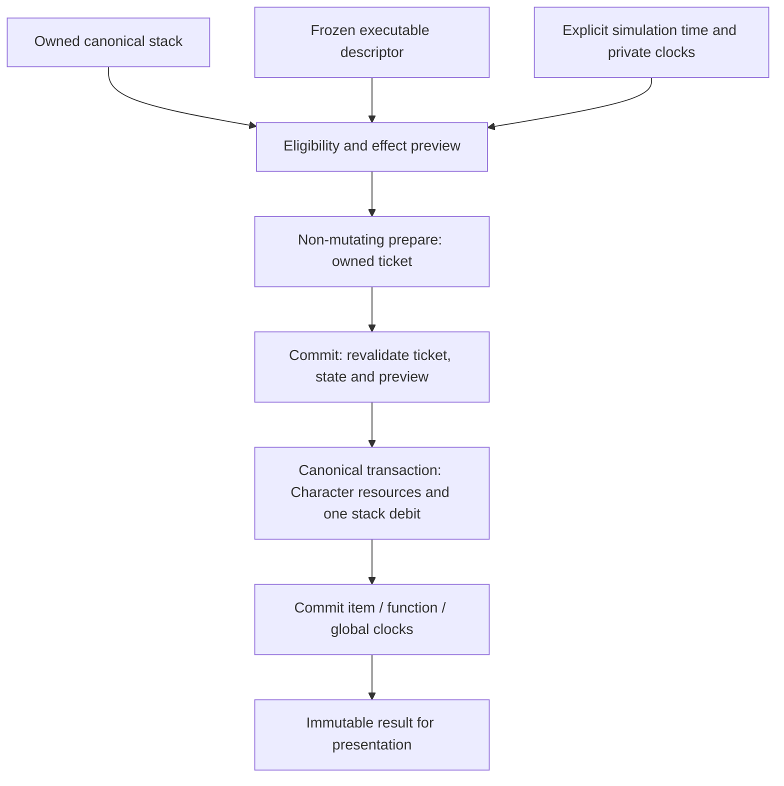

# Patch 0.0.1 Action Item / Consumable Execution foundation

This extends the existing Progression, Stats, Skill Tree, Combat, eight-slot
Action Loadout and canonical Item foundation. The release roadmap remains the
design authority. **Patch 0.0.1 and Core Spine are not complete.**

## Responsibilities

| Module | Responsibility |
| --- | --- |
| `item-definitions.js` | Frozen authored consumable effects and executable action policy; no timestamps |
| `action-item-config.js` | Provisional simulation-second cooldown defaults and full-resource policy |
| `item-effects.js` | Pure effect validation, resource preview and dispatcher boundary |
| `action-item.js` | Immutable executable descriptor compilation; no ownership |
| `action-item-runtime.js` | Eligibility, owned tickets, exact-once execution and private cooldown maps |
| `item-state.js` | Existing canonical inventory authority; contained effect/debit publication boundary |
| `character-state.js` | Current HP/SP authority; validates both resource values before setting either |
| `player-state.js` | Trusted synchronous adapter connecting runtime, Character and inventory |
| `game.js` | Existing input/Bag presentation and simulation-context provider |
| `tools/inventory.html`, `tools/inventory-harness.js` | Isolated inspection and deterministic disposable controls |



Basic Attack, learned skills and Action Items remain separate sources. Executable
consumables use `source: 'actionItem'`. Potion/Ration have no learned ranks,
prerequisites, Skill Point expenditure or entries in learned slots 1–8. Existing
skill source labels and persistence are retained; no shared hotbar schema is added.

## Authored definition and compiled descriptor

Only the existing two consumables execute in production:

```js
// In ItemDefinitions; current numbers retained.
effects: {restoreHP: 45},
actionItem: {
  actionKind: 'resourceRestore', target: 'self',
  cooldownGroup: 'hp-potion', usableStates: ['town', 'field', 'dungeon']
}
```

Ration uses `{restoreSP:20}` and group `sp-potion`. These group names follow the
roadmap's HP/SP function distinction. No Food/Drink/Utility production group or
new catalogue is activated. A test-only override gives the existing Ration ID
the HP function to prove switching IDs cannot bypass shared cooldown.

`AstraeonActionItem.compile(id, catalog?, config?)` produces frozen `{ok,
descriptor}`. The descriptor includes `itemId`, `source`, `actionKind`, `target`,
typed `effects`, `cooldownDuration`, `cooldownGroup`, `groupCooldown`,
`usableStates`, `tags` and provisional `metadata`. Item duration may override the
configured default. An explicit null group disables only the group layer.

Unknown IDs and non-consumable/non-stack definitions reject. Effects must be a
nonempty plain authored object whose only keys are `restoreHP`/`restoreSP`, with
finite positive numeric amounts. Zero, negative, strings, NaN, Infinity, missing,
unknown and malformed effects reject. Compiled effects require known type,
positive finite amount and self target. Action kind, usable states, group lookup
and all configured clocks are validated. Configured cooldown zero is supported.

`item-effects.js` owns the small resource dispatcher table. It validates the
entire list before publishing any result; preview is immutable and does not
change the input resources. Overflow rejects before execution. Future buffs,
cleanse, resurrection, teleport, damage and utility need their own validated
handlers and authority adapters; they are not implemented or accepted now.

## Player API and eligibility

```js
const context = {
  now: 12, actorPresent: true, state: 'field', intent: 'action',
  menuOpen: false, transitionPending: false,
  actionActive: true, restricted: false
};
const state = player.getActionItemState('potion', context);
const ticket = player.prepareActionItem('potion', context);
const result = player.commitActionItem(ticket, context);
// Immediate input convenience: prepare + commit in the same synchronous turn.
player.requestActionItem('ration', context);
player.getActionItemRuntime();
player.invalidatePreparedActionItems(); // Retains clocks.
player.resetActionItemCooldowns();       // Developer-only in gameplay.
```

`getActionItemState` returns frozen descriptor, canonical quantity, eligibility,
blocked reason, ready time, remaining time and resource plan. Valid blocked states
have `ok:true, eligible:false`; malformed requests have `ok:false`. Prepare and
commit failures include `consumed:false` and structured `code`/`blockedReason`.

The context requires finite nonnegative `now`; supplied flags must be booleans.
Time cannot precede the latest successful commit, or precede a ticket's prepare
time. Missing state defaults to town for isolated callers. Production supplies
the actual state, actor and simulation time through the game adapter.

Eligibility validates definition/effects/config, positive safe-integer ownership,
actor, finite resources and positive maxima, alive state, restrictions and useful
effect, then ready clocks. Priority is deterministic: full-resource rejection
precedes cooldown rejection when both apply. A rejected request changes no
inventory, current resources or cooldowns.

| Situation | Policy / reason |
| --- | --- |
| HP is zero | `DEAD`; no self-resurrection |
| Missing actor | `NO_ACTOR` |
| No quantity | `INSUFFICIENT_ITEMS` |
| Loading/transition or generic disabled flag | `FORBIDDEN_STATE` |
| Menu plus action input | `MENU_OPEN` in the core; existing input also blocks menus |
| Intentional Bag use during menu | Allowed with `intent:'inventory'`, preserving current interaction |
| Active Timeline | Allowed, preserving existing Potion behavior |
| Town, field, dungeon | Allowed for both authored consumables |
| Unsupported authored state | `UNUSABLE_STATE` |
| All authored resources already full | `FULL_RESOURCES`; no consumption/clocks |
| Ready time is in the future | `COOLDOWN` |

Full-resource rejection preserves the existing Potion input's useful-heal policy.
The previous direct Bag helper could consume at full resources; both Bag items
now follow the same rejection policy. This deliberate consistency change grants
no resources or items and avoids spending a consumable for a zero effect.

An injected `itemRestrictions(descriptor, context, resources)` must return exactly
true; false/exceptions reject `ITEM_RESTRICTION`, or a returned structured code is
used. Commit reevaluates it. This is a trusted synchronous, side-effect-free
extension hook, not a full status/CC or server-authority system. Recursion cannot
perform another item execution while a restriction/effect commit is running.

## Prepare / commit and atomic application

Preparation calculates a clamped preview and creates a frozen package registered
in the runtime's private WeakMap. It does not debit inventory, set resources or
start clocks. Its data is inspectable; copying those data does not grant authority.

Commit accepts only that exact object from the same runtime. It checks used
status, private revision, canonical inventory object identity, time, current
eligibility and a descriptor/resource-plan signature. An intervening successful
item action, inventory mutation (including remove/readd to the same count),
resource change or explicit invalidation rejects stale authorization. Duplicate
commits reject `ALREADY_COMMITTED`; clones/foreign/forged values reject
`INVALID_PACKAGE`. Two prepared tickets cannot both succeed even at zero cooldown.

The Player adapter uses private `consumeStackWithEffect(id, 1,
expectedInventory, apply)` on the existing item controller. It plans canonical
removal and validates equipment modifiers before calling the contained effect
setter, then publishes the planned inventory. The Character pair setter validates
HP and SP before either assignment, and clamps through Character maxima. The
adapter rechecks the exact resource snapshot before setting it. Both controllers
are synchronous; nothing yields between effect and debit publication. Nested
inventory mutation during publication rejects `TRANSACTION_IN_PROGRESS`.

Only after this transaction succeeds does the runtime mark the package used,
invalidate other outstanding packages and publish cooldowns. Invalid callback,
exception, stale inventory or rejected setter starts no clock and publishes no
debit. The low-level callback is a trusted internal adapter, excluded from Player
and live developer exports. Arbitrary callbacks that mutate unrelated state are
not rollback-capable; future effect handlers must honor the same prevalidate and
non-throwing synchronous commit contract.

Results are frozen and include `itemId`, source, consumed status, quantity
before/after, resource before/after, per-effect applied amounts, cooldown group,
clock evidence and provisional metadata. Character retains all formulas;
inventory retains stack identity/serial; Stats and Combat formulas are unchanged.

## Cooldowns and time

Runtime owns separate item-ID and function-group maps plus a global clock hook.
Ready time is the maximum of all applicable layers. Clocks start at commit time,
never prepare time or rejection time. HP and SP groups are independent. Any
future sibling ID in the same function shares its group, irrespective of physical
inventory representation. Item clocks can be longer than group clocks.

Current config is **provisional**: item 2 seconds, HP group 2 seconds, SP group
2 seconds, global 0 seconds. This supplies executable proof and is not approved
final balance. Restore amounts remain authored +45 HP/+20 SP. No production
global linking to learned skills, sickness, combat lock, animation timing or
final hotbar size is introduced.

The core never reads Date.now/performance.now. Gameplay supplies its existing
`now` in simulation seconds. Menus, loading and hidden-page simulation pauses
pause cooldown progress; no offline elapsed wall time is applied. The isolated
harness owns a monotonic developer time with exact advance controls. Clearing
clocks invalidates tickets and retains the last successful time floor.

Compatibility `useConsumable(id, context?)` delegates to the same runtime. It uses
an explicit context, then an injected `getItemContext`, then `{now:0,
intent:'inventory'}` for historical isolated callers. This fallback does not
advance time: repeated isolated uses need explicit time/provider or developer
reset. The real game and harness always inject their actual clocks.

## Gameplay, persistence and lifecycle

Q and the existing Potion button call `requestActionItem`. Existing Bag Potion
and Ration call the compatibility alias with real gameplay context. Successful
input keeps the existing audio/spark/toast/save behavior. No final HUD or new
production control is added. Camp cooking retains its separate recipe-like
Ration cost plus HP/SP result; shrine offering retains its Herb cost and blessing.
Both continue canonical item debit and are not direct consumable actions.

| Event | Ownership | Runtime policy |
| --- | --- | --- |
| Save | Current canonical remaining quantities/instances/equipment | No clocks/tickets serialized |
| Reload | Version 5 inventory remains authoritative | Fresh runtime, clocks empty, time floor zero |
| Death/respawn | Remaining items retained; no refund/grant | Keep clocks on the same simulation timeline; invalidate tickets |
| Town/field/dungeon travel | Same canonical ownership | Keep clocks on the same timeline; invalidate tickets |
| Class/training change | Existing item ownership retained | Existing combined action invalidation also invalidates item tickets |

Existing travel/room/death/respawn callers use `invalidatePreparedActions`; Player
now combines learned and item invalidation. This does not reset either clock
system. No camera, death mechanics or transition geometry is changed.

Save version deliberately remains **5**: action descriptors are authored code,
and ownership still uses the same schema. There are no new persistent runtime
fields. Existing pre-v5 migrations, canonical precedence and future-version >5
protection remain unchanged. Twenty normalize/save/load cycles prove consumed
quantities are not reimported, refunded or duplicated.

## Developer tooling and verification

`/tools/inventory.html` uses only `astraeon-inventory-dev-v1`, never the playable
save key. Its Action Item section inspects canonical quantity, authored effects,
compiled descriptor, eligibility/remaining clocks and prepare/commit results.
Controls add either current consumable, use, prepare/commit, set low/full test
resources, advance monotonic simulation time and reset item clocks.

Live developer APIs require exact `dev=1`; normal URLs expose no intended mutation
API. Pure module globals remain available to the loader, with private state
contained. Boot/page/SW and developer imports use cache version **89** and
precache all four new modules for offline saved-character boot.

Run `tools/run-node-checks.py`, `tests/action_item_browser.py`, the existing item,
Action Loadout, Combat, Skill Tree, Progression and cache suites, world-schema
validation and `git diff --check`. See [verified handoff](CORE_SPINE_ACTION_ITEMS_REPORT.md).
