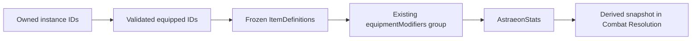

# Patch 0.0.1 item instance / inventory / equipment foundation

This contract extends Progression, Stats, Skill Tree, Combat Resolution and the
eight-slot Action Loadout. The Backbone release roadmap remains authoritative.
This is one Core Spine foundation; **Patch 0.0.1 is not complete**.

## Responsibilities

| Module | Responsibility |
| --- | --- |
| `item-definitions.js` | Deeply frozen existing content, stable lookup, legacy mappings, recipes and merchant prices |
| `item-inventory.js` | Pure immutable stack/instance transitions, serial allocation, normalization and carried weight |
| `item-equipment.js` | Pure instance/definition/slot validation, equipment transitions and modifier compilation |
| `item-state.js` | Private canonical ownership, migration, compatibility views and atomic craft/trade/reward plans |
| `player-state.js` | Item controller attachment, Character modifier integration and resource consumables |
| `save-state.js` | Version 5 normalization, historical migration and persistent serialization |
| `game.js`, `exploration.js` | Contained adapters for existing gameplay and presentation |
| `tools/inventory.html`, `tools/inventory-harness.js` | Isolated developer presentation, no item formulas or validation |

Definitions, owned objects, equipment references and displayed names are separate.
Core operations have no DOM, clock, RNG, storage or rendering dependency.

## Definition and ownership contract

Definitions have `id`, `name`, localization `key`, `kind`, `stackable`, `maxStack`,
`equipmentSlots`, `weight`, `modifiers`, `requirements`, `tags` and `metadata`.
Current authored resource effects use `effects`. Lookup uses stable definition ID,
never displayed name. Unknown IDs return null. All nested authored data is frozen.
Kinds are data: a future non-stack object can be owned without being equipment.

```json
{
  "itemInventory": {
    "stacks": {"herb": 3, "ore": 2},
    "instances": {
      "item-1": {"instanceId": "item-1", "definitionId": "astral-blade", "metadata": {}}
    },
    "nextItemSerial": 2,
    "history": {}
  },
  "equippedItems": {"weapon": "item-1", "offHand": null, "armor": null, "shoes": null, "relic": null},
  "itemHistory": {"inventory": {}, "equipment": {}}
}
```

Stack quantities are positive safe integers keyed by definition ID; zero removes
the entry. Stackables have no instance ID. Instances contain identity, definition
reference and cloned JSON-compatible metadata, never a full definition, derived
stats or random roll. Metadata accepts finite numbers, strings, booleans, null,
arrays and plain objects; cycles/functions/non-finite values reject atomically.
Future enhancement/affix/binding/provenance fields can use metadata without
replacing identity; none of those systems is executable now.

Creation allocates `item-N` from the persisted monotonic serial and increments it
once. Deletion never lowers the serial. Normalization raises the serial above the
highest observed valid-format ID, including quarantined malformed instances.
Allocation refuses exhausted safe-integer space; it never wraps or reuses IDs.

Normalization quarantines unknown or malformed stacks/instances in inventory
history and excludes them from effects/weight/operations. Duplicate or mismatched
equipment references normalize to null, first valid slot wins. Presence of
canonical `itemInventory` always takes precedence over legacy counters, even
when the canonical value needs repair. It never triggers a second legacy import.

## Shared authoritative API

`AstraeonPlayer.attach(state)` exposes:

- `getInventory()`, `getQuantity(id)`, `getInstance(instanceId)`, `getHistory()`.
- `canAddStack(id, amount)`, `addStack(id, amount)`,
  `canRemoveStack(id, amount)`, `removeStack(id, amount)`, `consumeStack(id, amount)`.
- `createItemInstance(id, metadata)`, `deleteItemInstance(instanceId)`.
- `getEquipment()`, `getEquipped(slot)`, `canEquip(instanceId, slot)`,
  `equip(instanceId, slot)`, `unequip(slot)`.
- `getEquipmentModifiers()`, `getEquipmentEffects()`, `getCarriedWeight()`.
- `reward(stackMap)`, `craft(recipeId)`, `buy(id, amount)`, `sell(id, amount)`,
  `useConsumable(id, context?)`, `acquireEquipment(id, slot, options)`.

Mutations return frozen `{ok:true, ...}` or `{ok:false, code}` results. Unknown
definition, non-stack misuse, nonpositive/fractional/unsafe quantity, insufficient
ownership, overflow and configured maxStack reject before committing. Invalid
instance metadata does not consume a serial. Equipped deletion rejects
`ITEM_EQUIPPED`; unequip first. Replacing equipment retains the old instance.

Current active slots are `weapon` (Main Hand), `offHand`, `armor` (Body),
`shoes`, `relic` (Accessory). See [slot closure](CORE_SPINE_EQUIPMENT_SLOTS.md).
`getEquipmentSlots()` exposes all five; `getEquipment()` retains the historical
three-key compatibility projection. Equip verifies instance ownership,
known definition, equipment kind, supported target slot and no second-slot use.
An injected synchronous `equipmentRequirements(requirements, instance, slot)`
must return exactly true; false or exceptions reject. Production requirements
are empty. No class/level/primary-stat restriction has been invented.

The private controller publishes frozen canonical getters. Legacy `inventory`
is a derived read-only counter view. Legacy `equipment` presents names; its
bounded historical setter routes recognized names through canonical acquisition
and equip, reuses owned objects, and repeated selection creates nothing. Unknown
names are archived and have no effects. Production adapters exclusively mutate
the canonical API. These are trusted local APIs, not server authentication.

## Stats, Combat and resource safety



Item modifiers use the existing `primary`, `add`, `multiply` language. The item
modules neither calculate derived values nor introduce formulas. Player compiles
currently equipped definitions once, followed by explicit runtime equipment
modifiers; learned passives, party modifiers and temporary groups keep their
existing boundaries. `progression-config.js` legacyEquipment data is retained for
historical compatibility but no longer adds a second contribution.

Character validates/derives proposed modifiers before item commit and remains
the HP/SP authority. Raising maxima does not heal; lowering maxima clamps current
resources. Failed modifier validation preserves items/equipment/resources.
Repeating equip/unequip replaces the group, never accumulates it. Save capacity
normalization excludes transient modifiers and does not bake equipment into
resourceBase. Combat consumes the usual derived snapshot without resolver edits.

Warden Plate retains its existing definition data. Its DEF +2 reaches Stats and
the shared incoming Combat resolver through the [Monster Lifecycle adapter](CORE_SPINE_MONSTER_LIFECYCLE.md).
The historical additional flat subtraction is no longer applied, so Plate DEF
enters incoming mitigation once. This is not a new status framework or approved
balance. Current production gear does not add HP/SP; injected unit fixtures
prove primary, percentage and resource-maximum modifiers without adding content.

## Save version 5 and deterministic migration

Version **5** is deliberate: ownership now includes stable non-stack identity,
a persisted allocator and equipment references rather than independent counters
and strings. This is a schema-generation change. The version increments exactly
once; storage key remains `astraeon-iso-v1`. Versions above 5 reject before
normalization/boot/autosave and preserve unsupported bytes. Versions 4 and earlier
retain the existing Progression/Stats/Skill/Loadout migrations before item import.

Legacy materials/consumables map to the same canonical definition-ID quantities.
`blade`, `plate`, `charm` counters become that many distinct instances in fixed
mapping order. Equipped known names reuse an existing matching owned instance;
they do not grant another copy of a crafted item. A known equipped-only object
is imported once with `legacyEquippedOnly:true`; the compatibility crafted-gear
counter excludes this marker to preserve its original value. This represents
existing equipped ownership. Traveler Blade/Adventurer Garb become the two
existing starter owned objects. Explicit None creates nothing.

Known chapter relic names map explicitly. Unknown historical equipment is retained
in `itemHistory.equipment` and compatibility presentation, with no instance or
invented modifier. Unknown inventory keys and equipment slots survive in history.
Raw old data is archived once; current compatibility counters always project
canonical quantities. Legacy integer normalization retains prior Save semantics.

Migration IDs/order are deterministic. Subsequent normalization/save/load sees
canonical presence and never reimports counters/strings, grants rewards, advances
serial or changes equipped identity. Progression, ledgers, ranks, Nodes, eight
slots, currency, quests, world claims and historical fields remain supported.

To avoid allocating unbounded legacy gear counters, import rejects more than
10,000 counted non-stack objects with `ITEM_MIGRATION_LIMIT`. This is a technical
import guard, not a gameplay capacity/weight rule. Boot blocks overwrite and
preserves the original save for a future importer; nothing is silently truncated.

## Existing gameplay transactions

Recipes use definition-ID inputs/outputs. Craft plans all material removals and
the output before commit. Stack output adds quantity; equipment output creates a
unique instance with recipe provenance. Insufficient input or output overflow
consumes nothing and advances no serial. Profession XP increments on success only.

Merchant prices remain the existing provisional prices; controller data is
authoritative. Buying/selling validates amount, current currency, total price,
currency bounds and the item plan before committing item state then currency.
Rejected item/currency conditions preserve both. Current merchant handles stacks.

Potion restores 45 HP and Ration restores 20 SP through clamped Character setters
and one atomic canonical quantity debit. The [Action Item runtime](CORE_SPINE_ACTION_ITEMS.md)
now validates effects and exact-once tickets and commits independent cooldowns.
Full resources reject without consumption; both items stay outside eight skill slots.
Camp cooking/shrine offering retain their separate current effects
while consuming canonical Ration/Herb. Loot, quest, discovery and dungeon stack
rewards use canonical reward batches; chapter gear creates/equips an owned instance.
Existing EXP, gold, quest credit, death and travel behavior remains in the game.

## Provisional content, weight and tooling

Only 14 existing definitions are adapted: Herb, Ore, Relic Shards, Healing Flask,
Field Rations, Traveler Blade, Astral Blade, Adventurer Garb, Warden Plate,
Spirit Charm, Moonveil Sigil, Sunstone Crest, Dawn Circuit and Veilheart.
Astral Blade retains ATK/MATK +6, known relics retain +3, Warden retains DEF +2
and historical incoming reduction metadata 2. Five recipes and four merchant entries retain current
inputs/output/prices. These values do not certify final balance or catalogue.

Weights remain explicitly zero/unconfigured. The current
[capacity authority](CORE_SPINE_INVENTORY_CAPACITY.md) derives slot occupancy and
integer milliweight from canonical ownership, including equipped instances once.
Item State validates net candidates before publication; Stats carryWeight is
independent. No encumbrance penalties, expansion or bank is implemented.

Open `/tools/inventory.html` for definition/stacks/instance/serial/equipment/
modifier/derived/save inspection and add/remove/create/delete/equip/unequip/save/
reload/migration inspection controls. Key `astraeon-inventory-dev-v1` is isolated
from playable storage. Migration inspection does not replace the sandbox state.
Exact `?dev=1` extends the existing live development adapter with these item APIs;
ordinary URLs expose no progression/combat/item harness mutation globals.
Boot/page/SW version **95** imports and precaches the item, capacity, equipment slot registry and Action Item modules together.

See [verification and full handoff](CORE_SPINE_ITEMS_REPORT.md). This implements
identity/ownership/equipment foundation only. Production UI, final Action Item content/balance, final Box content/UI,
future Head/Garment/multiple Accessory slots, final content/balance, rarity, affixes, enhancement, sockets,
binding, durability, encumbrance and server authority remain future work.

## Action Item execution extension

The [Action Item contract](CORE_SPINE_ACTION_ITEMS.md) supplies validated current
HP/SP effects, non-mutating prepare and exact-once atomic effect/debit execution.
Potion/Ration remain canonical stacks outside learned slots 1–8. Full resources
reject without consumption. Item/function clocks are provisional, explicit-time
and separate from skills. Existing Stats/Combat/Progression/ownership authorities
and save version 5 remain intact; clocks are runtime-only. See the
[verification handoff](CORE_SPINE_ACTION_ITEMS_REPORT.md) for lifecycle evidence.

## Monster Loot integration extension

The [Monster Loot contract](CORE_SPINE_MONSTER_LOOT.md) adds per-life exact-once
monster rewards using the existing canonical ownership and Progression/Stats
contracts. Item/gear/currency rewards, Base/Job EXP and quest credit are planned
before synchronous publication. Existing formulas, learned skills, action slots,
Action Item execution and save version 5 remain unchanged. Claims are runtime-only;
boot/page/cache version is now 93. See the [loot verification handoff](CORE_SPINE_MONSTER_LOOT_REPORT.md).

## Monster Box opening extension

The [Box contract](CORE_SPINE_MONSTER_BOX.md) adds the canonical stackable
`monster-box-proof` capability and separate Box Content Tables. Item State exposes
private `canOpenable`/`commitOpenable` boundaries to Player: maximum package
preflight before entropy, then contained source debit plus complete canonical
stack/instance rewards. The existing reward planning loop is shared with Loot;
death claims and kill adapters are not reused. A transient Item State revision
also invalidates opening tickets after successful equipment-only mutations.
No Box-specific ownership schema or save version bump is introduced. See
[verified Box handoff](CORE_SPINE_MONSTER_BOX_REPORT.md).

## Capacity extension

`getInventoryCapacityState` and `canAcceptItemPackage` expose immutable derived
capacity and pure net source/output evidence. `grantItemPackage` commits a fixed
mixed package atomically. Every supported live ownership publication enforces
capacity; pure ItemInventory transitions remain candidate builders. Over-limit
loads are retained and no-worse reductions/removals/equipment reference changes
remain possible. Box envelope checks precede RNG. See the
[capacity contract](CORE_SPINE_INVENTORY_CAPACITY.md) and
[verified handoff](CORE_SPINE_INVENTORY_CAPACITY_REPORT.md).

## Equipment Slot Closure extension

The [slot contract](CORE_SPINE_EQUIPMENT_SLOTS.md) adds validated ordered five-slot
references, two non-final proof definitions and deterministic normalization
evidence for unsupported/conflicting references. Original authored gear values
remain unchanged. Ownership/serial/capacity stay canonical and equip/unequip
preserve them. Semantic aliases normalize to retained v5 IDs; no new save version
is necessary. Cache/boot/page is 95. New consumers use `getEquipmentSlots()`.

## Quest net transaction adapter

The [Quest foundation](CORE_SPINE_QUESTS.md) uses the same canonical ownership.
A narrow private `commitItemTransaction` validates complete stack/instance source
debits plus authored rewards through existing Capacity, builds a local inventory
candidate and publishes ownership once with contained Character/gold/completion
effects. It is excluded from the public Player item-method projection.
Collect reads current ownership and creates no separate ledger. Capacity or stale
authorization failure consumes nothing and allocates no instances/serials.
Existing Loot/Box, merchant/crafting and equipment contracts remain unchanged.

## Town Services / Storage extension

The live Player `buy`/`sell` compatibility methods now dispatch to the
[owned current-interaction Shop authority](CORE_SPINE_TOWN_SERVICES.md). Its
exact-instance sell and canonical stack/instance buys preflight the complete
package and currency before one Item State ownership publication. Standalone
historical fixtures retain physical trade primitives without live service
access. Definitions/prices/recipes in ItemDefinitions are unchanged.

A narrow private `commitOwnershipTransfer` validates exact final ownership,
current identity/revision, unchanged allocator and retained equipped refs before
contained Storage publication. Global observed Storage IDs reserve the canonical
serial during Item State migration; transfers do not allocate. Optional v5
Storage is a separate durable container, not carried Inventory or Equipment.
