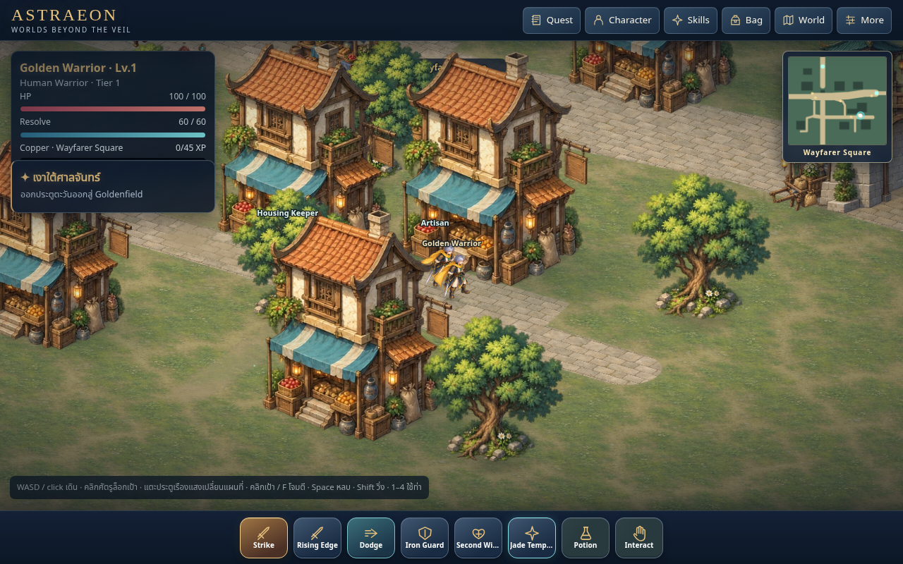
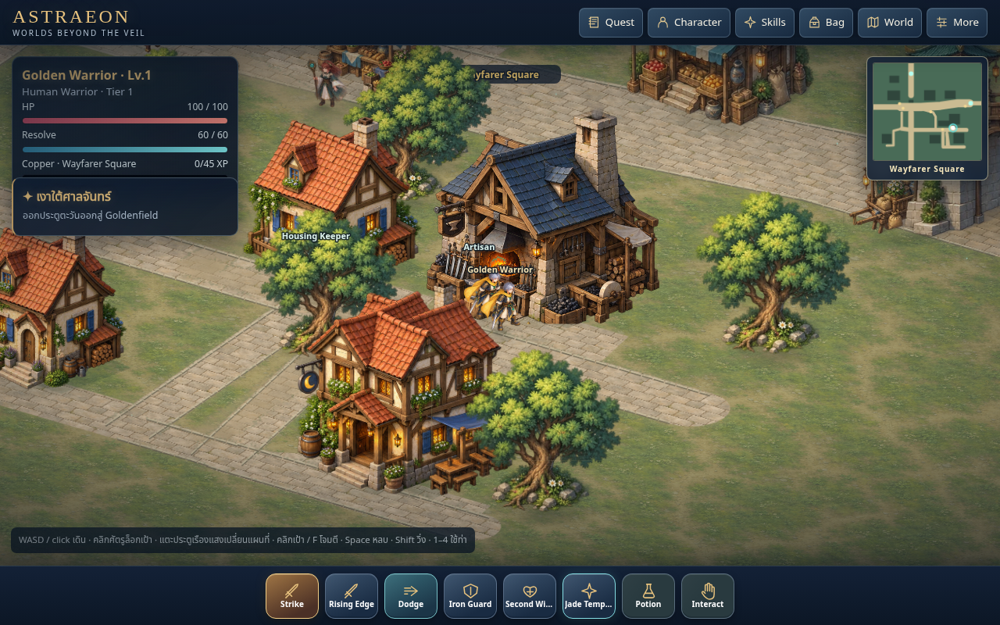
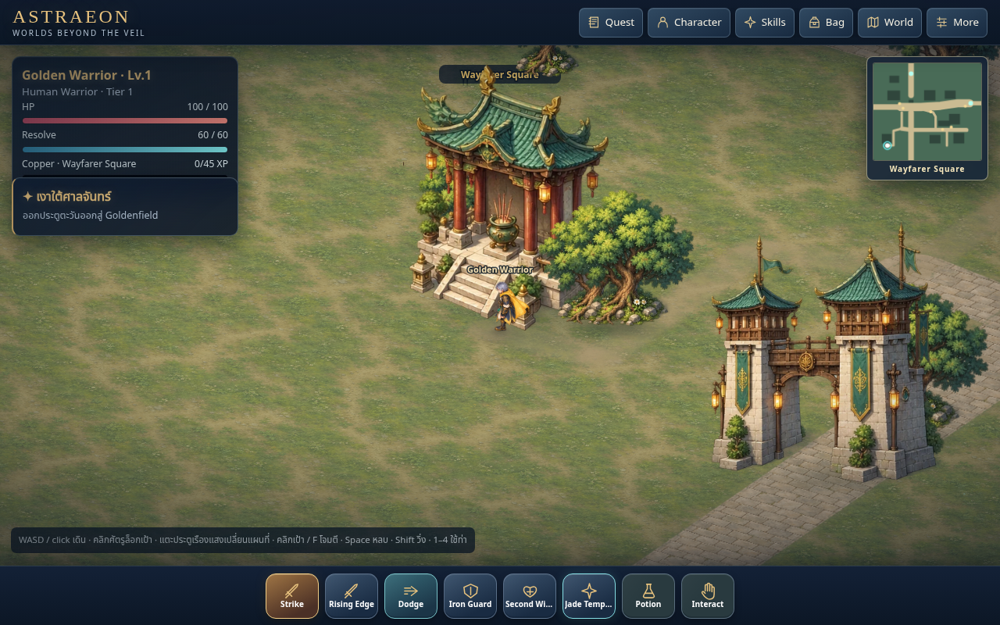
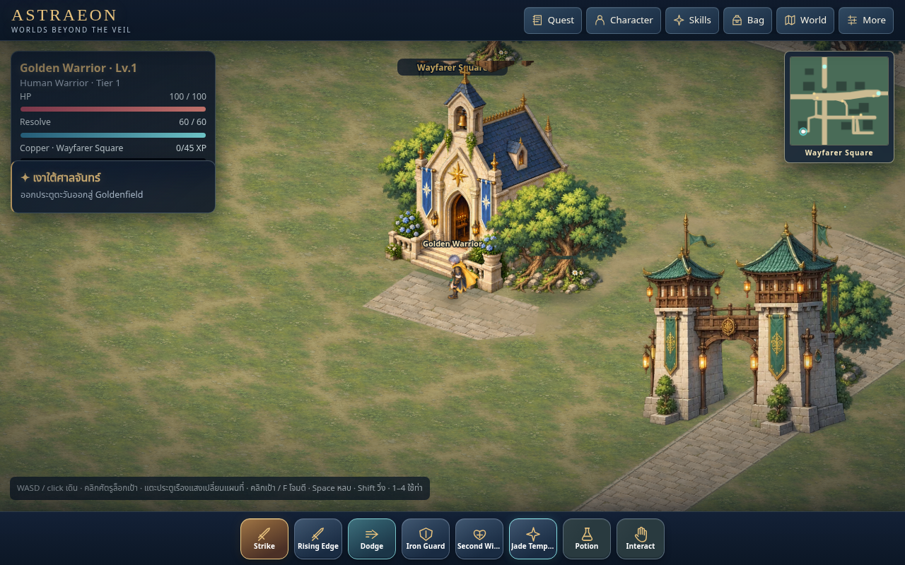

# Wayfarer / Warrior v29 review evidence

This is a playable production candidate, not a declaration of final Golden Baseline approval. Existing gameplay coordinates, occupied footprints, services and save formats are retained.

## Implemented

- Opaque, independently sorted frontage, rear mass and roof portions, with authored roof polygons for the Hall and new district assets; separately sorted tree trunk and canopy. Whole-building fading is removed. Ground footing shadows are cached, with a shared directional light and existing local painted form shading.
- Original replacement blacksmith, inn, shrine and cottage artwork. Civic roofing is converted to blue while preserving painted plane shading. Connected shrine, inn and residential paving, raised curb edges and entrance elevation ramps tie the artwork to the ground.
- A rebuilt Warrior atlas with all eight phases in all eight directions. Stable directional costume views are combined with authored textured leg geometry. Left and right contacts exchange roles at frame 4. Visible source bounds, root registration, body height and both foot contacts are recorded per frame. Source-space Y registration is used by the renderer. A separate masked torso atlas preserves the original sword and cape instead of truncating them at the leg boundary. Runtime walk bob, lean and stretch are disabled.
- Per-direction stance distance is calibrated against the existing camera projection. Playback follows simulation travel distance, including reverse movement. `warrior-rig.js` interpolates authored leg joints and seats the textured legs on the simulation’s actual world-space foot contacts; stance feet remain planted between atlas frames while the torso stays registered. Warrior rear views no longer use the two-pose fallback. Other classes retain their existing rear policy.
- v29 script URLs and service-worker cache include the new assets. A real v28-to-v29 upgrade preserved the save, loaded the rebuilt atlas, and removed the old cache.

## Review and verification

Actual navigation captures cover Consortium, plaza, market, workshop, residential, inn, shrine, gate and the field threshold. The town walkthrough passed all nine existing service/navigation/action checks at desktop, portrait, landscape and tablet sizes, with no runtime or resource errors. Separate actual field-combat captures cover Warrior hit and death, including persisted defeat penalties.

All 46 full browser smoke checks passed with no runtime or HTTP errors. The final registered/rigged Warrior review also passed separately.

47 focused Node checks passed, covering the existing movement/combat/save/navigation logic and the added opposite-leg, registration, layer coverage and raw-motion gates. Sprite review checks head stability independently of projected foot depth and checks the rendered foot bounds against the authored contacts; a forward foot must not be treated as a change in body stature.

The same 1280 × 800 headless Chromium court comparison measured median 42 FPS before and 41 FPS after, with median p95 frame time 33.4 ms in both. This is a cloud software-rendering comparison, not mobile hardware certification. Raw samples are in `golden-v29-performance.json`.

## Reproduction

Serve this checkout on port 8001. Run:

```sh
node --test tests/motion.test.cjs tests/golden_pipeline.test.cjs
python3 tests/golden_scene.py --url http://127.0.0.1:8001
python3 tests/district_visual.py --url http://127.0.0.1:8001
python3 tests/browser_smoke.py --url http://127.0.0.1:8001
```

Rebuild the Warrior atlas with `python3 tools/build-warrior-walk.py`. Reimport the reviewed original district source with `python3 tools/import-town-kit.py`. Both use Pillow; the Warrior builder also reads the existing metadata through Node. Generated build artifacts are committed assets, so the browser needs no asset-generation dependencies.

## Remaining acceptance limits

The new building roofs and Hall use authored polygon masks; retained legacy facades and tree silhouettes still use simpler partitions. The kit supports richer masks, but this pass does not add enterable building interiors or new under-roof passages. Door services remain proximity interactions. Costume orientation remains quantized to eight authored views. Leg geometry now follows continuous world-space contacts; turn transitions and prolonged sprinting still deserve physical-device review. No public deployment or physical mobile performance review was performed in this pass. Do not expand other towns or call the Golden Baseline finally approved on the strength of automated checks alone.

## Matched runtime images

The same normal-input routes, player destinations and 1280 × 800 viewport are used in both checkouts.

| District | Before | After |
| --- | --- | --- |
| Workshop |  |  |
| Shrine |  |  |
