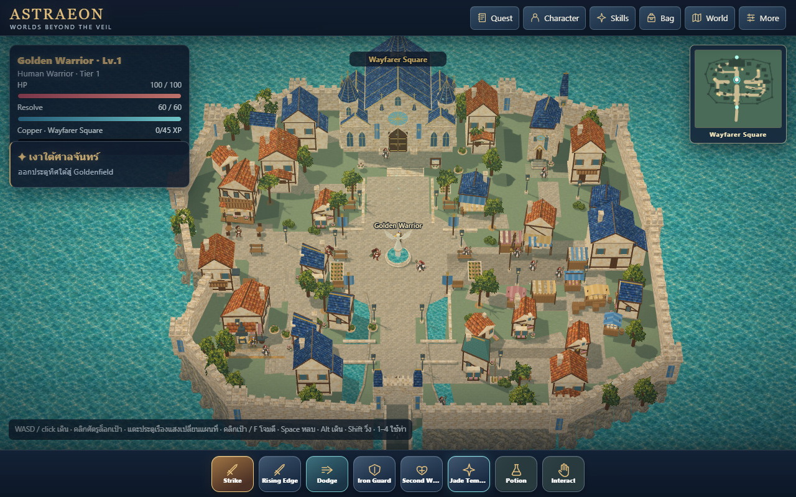
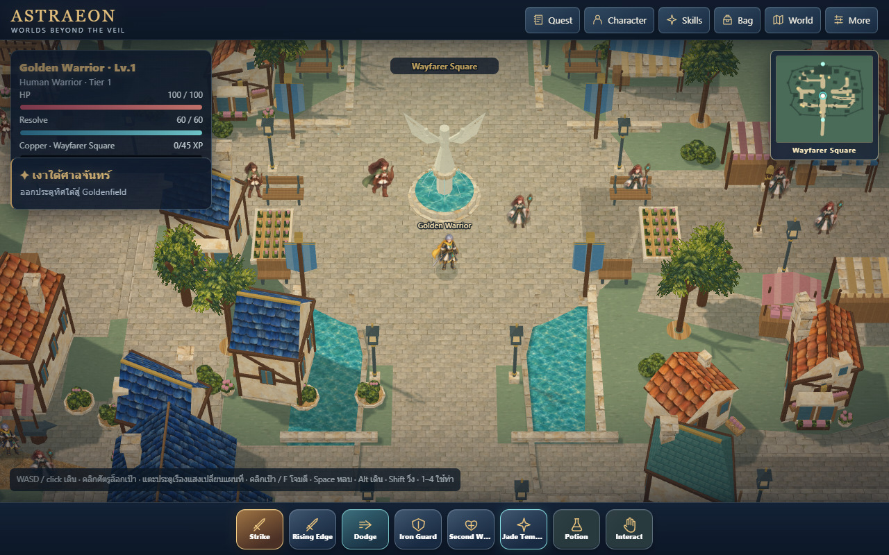
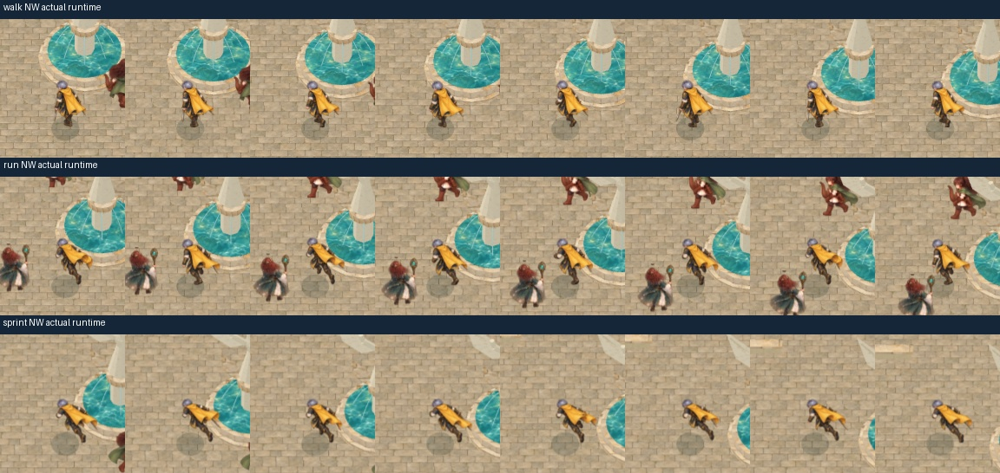
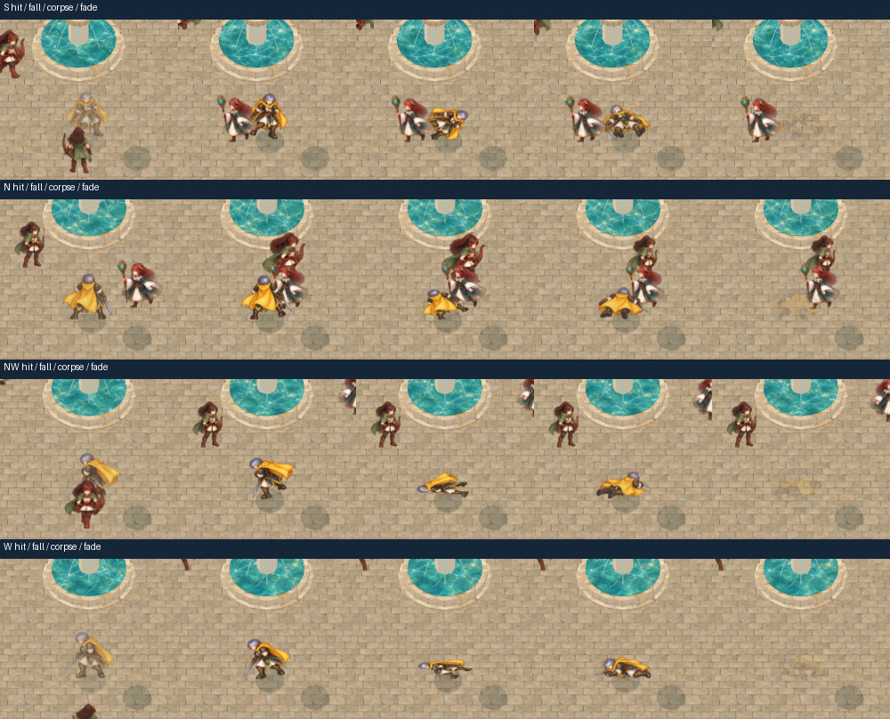

# Wayfarer v43 - local playable review, 2026-10-03

This pass continues the cloned `codex/world-pipeline-v3-proof` branch from
`f3dd316`. The playable town is reauthored toward the supplied Wayfarer concept;
the user's latest steering makes the classic Ragnarok camera the default.
Golden approval and the later mandatory productionization phase remain open.

## Camera and visual comparison

Default: 15-degree vertical perspective FOV, 50-degree downward pitch, yaw zero,
zoom 125, centered smooth follow. These values reference the public roBrowser
community implementation. They are not a claim about verified Gravity-client
defaults or RO3 camera internals. See [applied research](../../../research/wayfarer-applied.md).

The overview uses a disposable art-review save and ordinary Ctrl-right-drag to
zoom 325. Gameplay defaults remain zoom 125. This wide still shows the Hall above
the central fountain, inn/forge to the west, market/shrine to the east, connected
districts, guarded river boundary and southern crossing. It is not gameplay
traversal evidence; the normal-input reports below provide that separately.

Additional default-camera views: [arrival](arrival.jpg), [Hall](hall-axis.jpg),
[market](market.jpg), [inn](inn.jpg), [forge](blacksmith.jpg), [shrine](shrine.jpg),
[residential](residential.jpg) and [river edge](town-edge.jpg).

## Changes reviewed

- Saved Hall nave/aisles, unequal towers and bell lantern, windows, portal,
  blue/gold roof details, material-matched stone and slate.
- Connected civic/district paving, larger winged fountain sculpture, individually
  composed building lots, market stalls, balconies, bays, awnings and chimneys.
- Fortified river walls, watchtowers, outward-facing rock banks, new original
  painted rock material, civic trees, flower courts, bushes, lamps and seating.
- Corrected a lodge that obscured the Artisan, lamps initially placed in water,
  and bridge geometry left at the old western gate. The old broad forecourt is
  narrowed to the crossing, and deck/parapets now reach the current field bank.
- Full-body Warrior walk/run/sprint, 8 frames in each of 8 directions. New NW
  strips and W sprint strip replace temporary repairs. No procedural limbs are
  overlaid on the new locomotion artwork.

## Evidence and limits

| Verification | Evidence |
| --- | --- |
| 67 Node tests, schemas, saved-source/export parity and shared parent transforms | Local commands completed after the final source edit |
| Normal-input lens, camera gestures, resets and rotated ground picking | [camera report](camera.json) |
| 8 districts x 4 viewports, stairs/gate, 8 services, 3 gaits x 8 headings, attacks, 8 reactions, respawn, field transition and reload | [complete gameplay report](full-gameplay.json), 56 recorded cases, no runtime/resource errors |
| Services after street furniture | [final service report](final-services.json), all 8 passed |
| Stairs and bridge/field crossing after the last bridge alignment | [final spatial report](final-spatial.json) |
| Legacy software-cache color/depth equivalence at arrival, pan, odd portrait dimensions and landscape | [cache report](legacy-cache.json), zero actor depth-mask disagreements |
| Latest default and wide art captures | [default records](final-views.json), [overview record](overview-view.json) |

The complete gameplay run precedes final material/furniture refinements; the
affected services, crossing, source and captures were rechecked afterward.
Reports come from ordinary input, read-only snapshots and existing authored route
queries. No gameplay position, HP, animation or time setters manufacture passes.

Latest solo default-camera captures measured approximately 8-12 ms for the
renderer statistic on Chrome D3D11 / Radeon 780M. These short local render
measurements are not full-frame FPS measurements or phone-performance certification.

The result has stronger hierarchy, coherent painted materials, clearer districts
and complete Warrior locomotion. More architectural sculpting, civilian variety,
other-class rear/action consistency and physical phone review remain important
quality work. Test passes and screenshots do not constitute Golden art approval.

The source scene and original illustration sheets remain editable and versioned.
Full local frame sequences and captures remain under
`C:/Users/Lenovo/AppData/Local/Temp/astraeon-local-preparation`.
