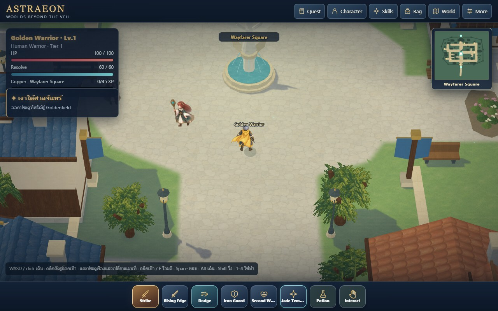
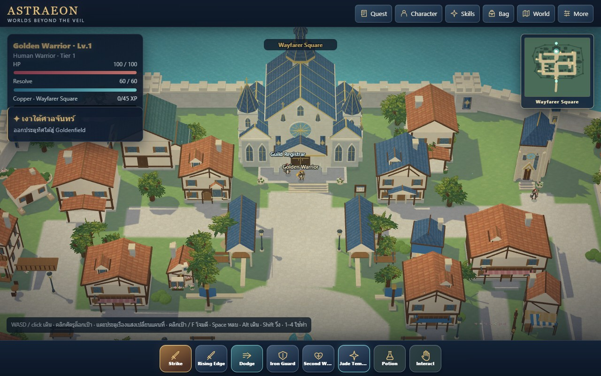
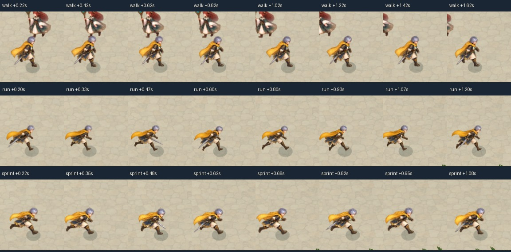

# Wayfarer v47 review candidate

This continuation applies the user's painterly MMO direction to architecture, material cohesion, lighting, density, connected placement, camera and visible movement contacts. The concept remains an identity/composition reference. Golden approval is pending; the result is not claimed to reproduce RO3's proprietary renderer or final production quality.

The town has four times its previous land area, twelve additional individually assembled lots, a stronger Hall silhouette, deeper facades, irregular court/planting, gentle street bends and softened paving/water boundaries. The 15-degree lens uses a shallower 46-degree pitch with classic community camera controls.

## Completed checks

- 71 Node tests and the four public schemas pass. Saved Blender/export parity and shared Hall ownership/transform checks pass.
- Ordinary-input replay passes all eight districts in desktop/portrait/landscape/tablet viewports, eight stair/gate cases, eight services, 24 gait cases, turns/attacks, hit/death/respawn in eight directions, field transition and save reload. No runtime/resource errors.
- Maximum rendered stance error and drift across the 24 gait cases are below 0.025 world units (observed near floating-point precision). Rear-view weapon-tip selection, airborne phases, landings and repeated flight-offset resets were corrected during this replay.
- Camera defaults, independent Three physical-perspective equivalence, orbit/tilt/zoom/resets and rotated click navigation pass. Legacy cache/direct comparison passes four views with zero actor depth-mask disagreement.
- Final sound-on, 1280 × 800, 6.5-second movement sample: **59.7 FPS**, **16.8 ms p95**, **49.9 ms maximum**; mean update 0.42 ms / draw 1.83 ms; 296 rendered sole samples. Chrome D3D11 / Radeon 780M. This short local sample is not a guarantee of stutter-free performance on every device.

## Evidence

`gameplay.json` records ordinary-input traversal, interaction and animation checks. `movement-frames.jpg` and three `*-gameplay.gif` files sample actual rendered motion. Eight `reaction-*.jpg` strips sample real sparring hit/death/respawn. Representative JPGs cover normal gameplay and responsive views. `views`/`landmark` records separately label disposable-save still comparisons at wider user-controlled zoom; these do not establish traversal.

`performance.json` measures sound-on whole-frame intervals and registered sole error on this machine. `camera.json` records physical perspective equivalence and ordinary gestures. Local timings are not universal FPS or phone certification. The 71 Node tests include full-width street/building/lot checks, all closing patrol legs and cross-town routes. Public schemas and saved Blender/export parity are separate checks.

Raw PNGs, frame series and historical working views remain outside the checkout in the artifact directory recorded in `CURRENT_HANDOFF.md`; original art remains in authoring folders. Screens and animation samples require human judgment. Passing checks do not grant Golden acceptance.

