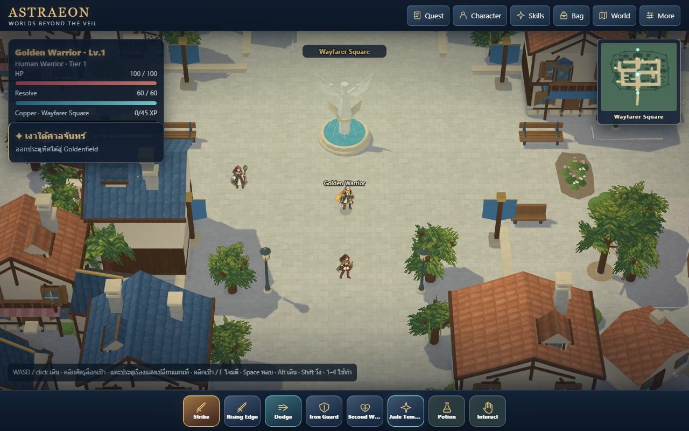
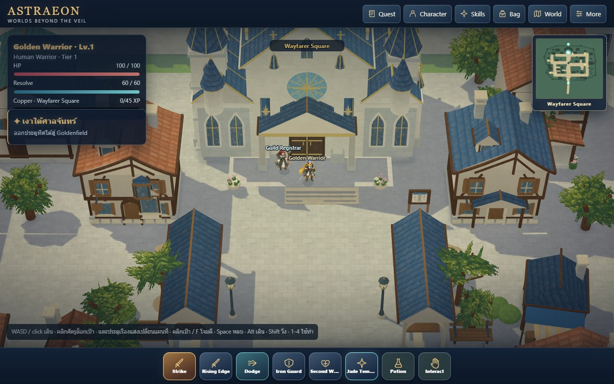
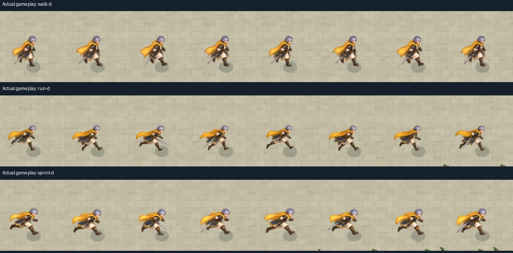

# Wayfarer v48 review candidate

This candidate improves connected city paving, facade/roof depth, overhang lighting and playback continuity. **Character gait artwork remains unfinished. Golden visual acceptance is pending.** The newly generated same-leg strip was rejected and is not installed.

## Changes ready for review

- Connected stone interior with a planted shoreline belt and thirteen framed tree courts. The concept is a placement/identity reference, not an exact diagram.
- Twelve frontage lots gain projecting windows, shutters, shaded framing, corbels, dressed foundations and chimneys. Hall gains crowned corner turrets and roof-gallery details.
- Saved Blender meshes carry baked AO/sun factors; the renderer applies broad warm/cool value separation without extra runtime raycasts.
- Painted bodies no longer freeze between atlas frames. Mage/Ranger cadence uses distance at a 2.1-unit cycle, their available rear frames are no longer reduced to two poses, and Alt walking works for all three classes.

## Checks and limitations

73 Node tests, all four public schemas and saved Blender/export parity/shared Hall transform checks pass. Ordinary-input gameplay covers 56 recorded cases: districts/responsive views, stairs/gate, all eight services, 24 Warrior gait cases, turns/attacks, eight real sparring hit/death/respawn directions, field transition and save reload. No runtime/resource errors. Mage and Ranger separately pass eight-direction running replays, turns/attacks, transition and save reload.

The 24 Warrior gait cases cover all eight crop columns and have zero frozen-body frames during real movement. These assertions do **not** validate anatomical left/right leg alternation. Actual motion captures still expose weak source poses. Simulated foot metadata and the historical v47 whole-body sole lock were insufficient art evidence; the latter held the pelvis still between poses.

Initial sound-on samples averaged about 59.3 FPS / 16.8 ms p95 but failed the 80 ms maximum check with a recurring 83.5 ms interval. The trace isolated the expensive frame to scene rendering when a building first reveals the player. Fade geometry is now prepared/uploaded during loading, with real raster coverage and matching output color/MSAA. The last isolated sample passed the current budget: **59.4 FPS, 16.8 ms p95, 66.9 ms maximum**, zero frozen-body frames and eight pose columns for both the player and the moving civilian. A noticeable reveal hitch remains (the preceding draw took about 75 ms); this is not described as completely stutter-free.

`performance-final.json` records that sample; the other performance reports retain failed/intermediate observations. Local timing uses Chrome/D3D11 on Radeon 780M and does not certify phones. Four cached/direct legacy comparisons also pass with zero actor depth-mask disagreement. Exposed city-paving borders retain the feathered verge treatment.

No rejected generated gait images are shipped. Original left/right joint guides are retained for further authoring. A reliable, coherent opposite-leg cycle in all directions is still required before animation quality can be accepted. This candidate is saved locally; no v48 push or shutdown has been performed.

## Review evidence

`gameplay.json`, `mage-motion.json` and `ranger-motion.json` record normal-input cases. `views.json` labels disposable-save architecture comparisons at ordinary camera zoom. `movement-frames.jpg` and three gameplay GIFs are actual renderer captures, not proof of a correct gait. Raw images/series remain under `C:/Users/Lenovo/AppData/Local/Temp/astraeon-local-preparation/v48-*`.

The official RO3 first full gameplay trailer played successfully and was inspected this time; `research/wayfarer-applied.md` records the source and bounded visual inferences. No RO pixels or proprietary media are included.

