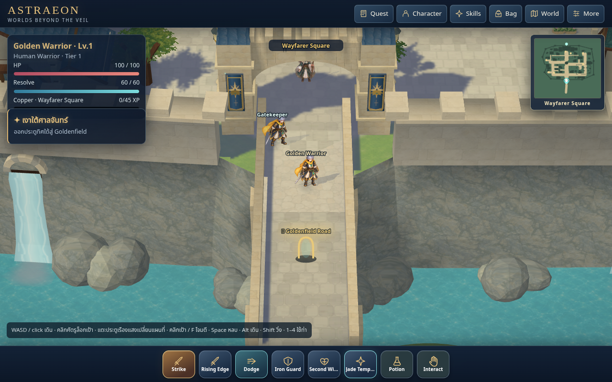
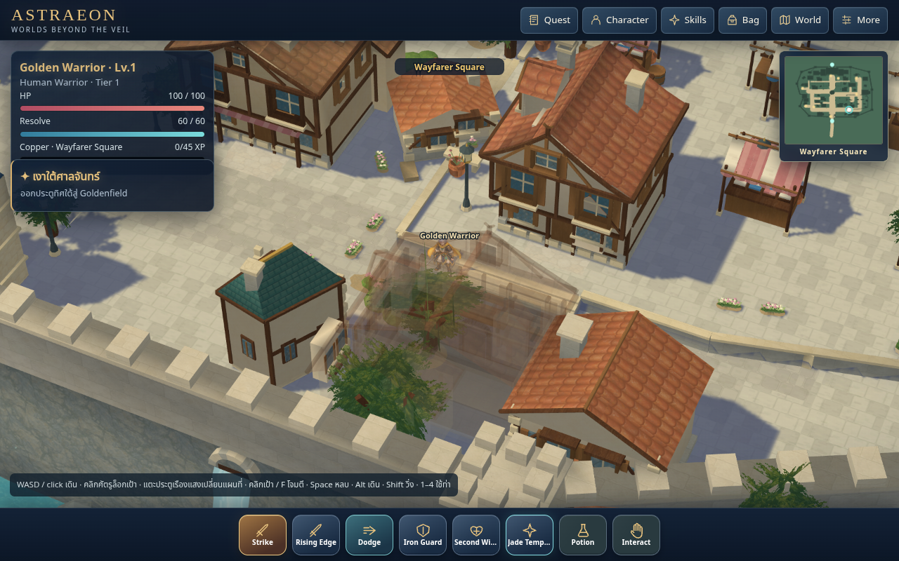
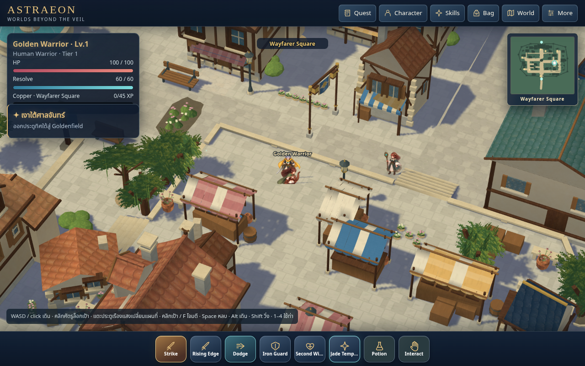
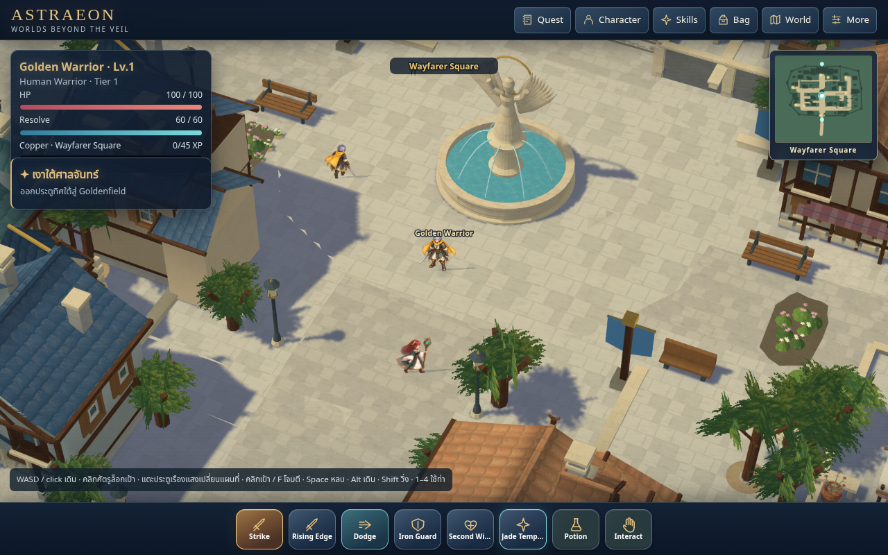

# Wayfarer source65 — continued town review

This continuation restores the unfinished source64 lighting and replaces the
twelve existing frontage window envelopes and small competing dormers. Larger
window openings have splayed reveals, recessed glazing and projecting sills.
One coherent cross gable per lot joins a real opening in the underlying roof
planes. Related home, merchant and workshop colors distinguish building families.
The saved Blender scene owns all of these forms and their lighting.

The approved ASTRAEON concept and ten local RO3 comparison images were inspected.
No proprietary models, textures, sprites or map pixels were imported. The original
town above water, Hall hierarchy, streets, terraces and market remain the baseline.
This is a bounded architectural pass; the town and locomotion remain unaccepted.
The Hall composition, overall density and painterly finish still need further review.
No replacement character artwork or cosmetics were installed.

## Source and preservation

Source: `authoring/wayfarer-spatial.blend`; matching export:
`world/v3/wayfarer-spatial.json`. Layout remains
`wayfarer-concept-terraced-town-v49`, with 119 objects.

The source64 → 65 comparison preserves terrain and walkable floors, navigation,
spawn/review routes, existing presentation/service anchors, portal transitions,
civilian patrol routes and every solid's geometry. See `native-preservation.json`.
The final visible geometry has 231,062 triangles versus 232,620 in source64; eight
additional material batches give the families distinct finishes. See
`geometry-budget.json`. Geometry count alone does not establish frame performance.

Both native bakes are current: 385,113 color corners on 9,865 meshes; 1024² floor-shadow
atlas with 615,909 land pixels and 327,474 shadowed pixels. Original foliage alpha is
sampled for tree casts. The floor bake's geometry digest is
`20d2c9cd129bb7ec0b1b953e99f5fb30bb93744868e68ddd5a5c043cc8b5efb2`.
Saved export parity and shared Hall transform/stale-bake invalidation pass.
Historical `v54` shadow filename remains intentionally unchanged.

Boot, index resource queries and all versioned service-worker precache entries
are aligned to 66. LocalStorage keys and save/progression contracts are unchanged.
The native town source stays at 65; runtime revision 66 removes the forced 0.5
software render ratio. Software WebGL now draws at native CSS resolution;
hardware follows screen density up to 1.5×. The user's low-resolution screenshot
was a real consequence of the old half-size drawing buffer behind a sharp UI.

## Verification

- 95 individual Node checks passed across six independent files; `node-report.json`.
- Terrain, Navigation, TownObject and AnimationManifest schemas passed.
- Saved Blender/export parity and shared Hall transform/bake invalidation passed.
- Thirteen civic/shrine/Hall stair and gate cases completed on final source65 at
  the former 0.5 runtime ratio; `spatial-partial.log`. The same replay then failed
  a market-return assertion because its base waypoint was inside the ordinary
  arrival tolerance of the first tread. This is partial evidence, not a full pass.
- Four market ascent/descent checks completed at native ratio1, followed by field
  transition and character reload; `market-native.log`. Its final resolution
  telemetry incorrectly sampled an inactive field renderer and failed after those
  assertions. The helper now measures the town before departure; the focused
  shrine retry validates that correction.
- Revision66 cache migration, 92 precached requests and offline reload retain the
  saved character, level/XP, inventory and equipment; `cache-report.json`.
- Isolated sound-on native-resolution cloud software performance **failed**:
  1.74 FPS / p95 883.3 ms / maximum 883.3 ms; `performance.json`. The drawing
  buffer is 1280×666 at ratio1, with no runtime errors. Only 11 player movement
  pairs were recorded, with no held roots; this is too few for continuity
  certification and does not approve painted contacts. The existing >55 FPS,
  p95<25 ms and max<80 ms gates were retained. Physical desktop/phone performance
  remains unverified. Native resolution was retained despite this failure.
- All eight native-resolution services opened through ordinary traversal and
  interaction across two replays; `services-report.json`. The initial replay
  completed seven, then timed out while still moving toward the shrine. The
  focused shrine retry passed, including a 1280×666 town drawing buffer at ratio1,
  actual field transition and saved-character reload; `shrine-retry.json`.
  Runtime/resource errors are empty. The first replay remains partial evidence.

The managed Node 24 default runner reported file-level results only. The new
`tools/run-node-checks.py` invokes each file separately with test isolation disabled,
retaining independent globals and exposing all 95 registered checks. Browser tools
now support Linux SwiftShader alongside Windows D3D11. Travel timeouts account
for authored route length, the slowest speed and the existing 250 ms simulation
cap when cloud RAF intervals are longer (bounded to 4× allowance). Game speed,
clock and isolated performance assertions are unchanged.

## Review images

These are disposable-save still comparisons at user-controlled zoom 160 / yaw 25,
with a 1.5 still capture ratio. They do not establish traversal or normal-play FPS.
`views.json` records camera/device and errors; still captures reported no
runtime/console errors. `arrival-native.png` is ordinary gameplay after the
runtime resolution correction, with no still-only render override.









## Reproduce

Serve the checkout with `python3 -m http.server 8011 --bind 127.0.0.1`.

```sh
python3 tools/run-node-checks.py --output /tmp/astraeon-node65
python3 tools/validate-world-v3.py
blender -b authoring/wayfarer-spatial.blend --python-exit-code 1 --python tools/check-blender-export-v3.py
python3 tools/capture-wayfarer-views.py --views residential,market,plaza --zoom 160 --yaw 25 --capture-scale 1.5
python3 tests/golden_wayfarer.py --phase spatial --output /tmp/astraeon-spatial65
python3 tests/golden_wayfarer.py --phase services --output /tmp/astraeon-services65
python3 tests/cache_resume.py --output /tmp/astraeon-cache66
python3 tests/movement_performance.py --output /tmp/astraeon-performance66.json
```

For an actual source edit, export the saved scene. Do not rebuild the town from
historical scripts. `author-frontage-families-v65.py` replaces only this pass's
frontage envelopes, preserving roof baselines and UVs; rerunning it requires both
lighting bakes. Save/export operations must be sequential, and performance should
run after authoring/capture jobs end. Windows bpy fallback details and the complete
prior diagnosis remain in `previous-handoff.md` and the October 4 pause evidence.
