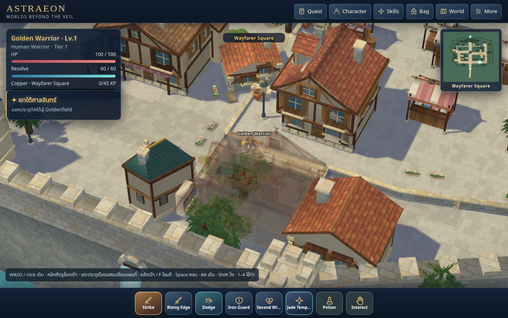
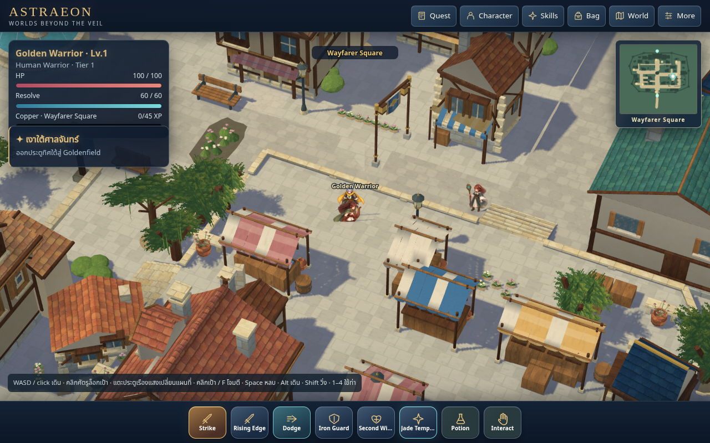
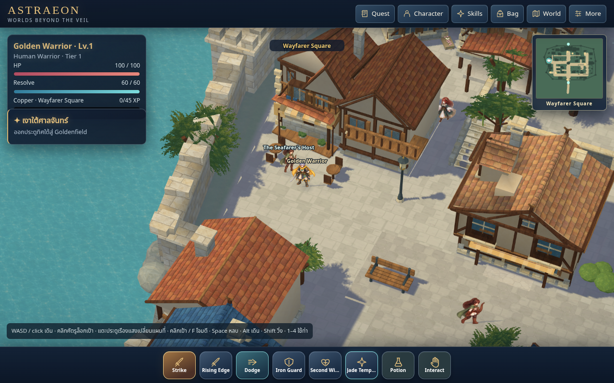
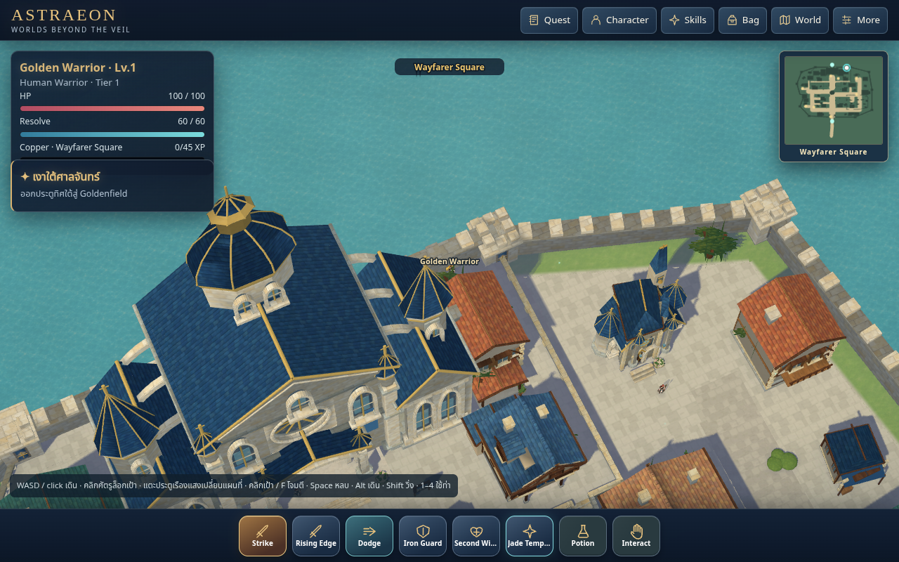

# Wayfarer exterior craft, texture and daylight review — source67

The user asked to keep pursuing building exterior detail, texture quality and
lighting/shading against `RO3 Ref/`. This pass continues source65 on
`codex/world-pipeline-v3-proof`, parent `91565428a5fd91acb524cbc9e19e1c404f4af5ac`.
The approved concept still owns the original town identity and layout. All ten
local RO3 reference images were inspected as presentation references; no
proprietary geometry or texture pixels were copied.

**Town accepted=false. Locomotion accepted=false. Cosmetics implemented=false.**
This is a reviewable improvement to the existing town, not full RO3 fidelity or
physical-device performance certification.

## What the references changed

| Reference emphasis | Result in this saved source |
| --- | --- |
| Layered roof edges, trim and timber brackets (`04_08_00`, `04_08_45`, `04_08_34`, `04_08_39`) | Twelve existing frontages gain eave beads, rafter tails, segmented ridge caps, side cornices, knee braces, window sills and shutter louvers. Twenty-two other existing lots gain belts and corner joinery following their actual wall polygons. |
| Flat clay/slate courses rather than oversized rounded tile shapes | New original clay and slate swatches; 316 roof faces remapped so U follows the ridge and V follows the slope, including continuous arc-distance mapping across the existing curved roof strips. |
| Dressed stone and visible wood surfaces (`04_08_30`, gate/wall references) | Original oak and limestone swatches feed existing palette colors. Twelve doors gain dressed-stone arch stones/jambs, an arched timber leaf and ironwork. Stone courses also read on existing walls and civic parts. |
| Warm sun, cool shade and depth around roof/window reveals | Native warm sun .68 / cool ambient .40, exported source-owned color tones, 16-ray corner contact bake and 1536² alpha-aware floor shadow bake. |

The twelve frontages retain source65's actual window openings and roof cuts.
Their lower door trim stays within the existing .18-unit collision margin;
`decor-clearance.json` checks every new low vertex against the source65 compiled
world. The taller trim remains above the 2.3-unit body-height assumption.
`native-preservation.json` compares all floors, solids, anchors and patrols with
source65. Neither navigation nor terrain was reconstructed.

## Original texture and rendering source

- Master: `authoring/materials/wayfarer-exteriors-v67-source.png`.
- Runtime: `assets/wayfarer-exteriors-v67.webp`, lossless encoding of that master.
- Provenance and measured linear means: `authoring/materials/wayfarer-exteriors-v67.json`.
- Actual atlas size: 1254²; four 627² tiles. This is improved painting, mapping and
  contrast, not a claim of more source pixels than the old v44 atlas.
- Each tile keeps its own mip chain. Native material metadata records
  `meanLinearRGB` and `paletteDetail`; the shader applies the swatch's variation
  relative to its mean to the existing palette, rather than washing most detail
  into a flat color. Old materials, cloth and foliage retain their prior behavior.
- The source67 floor bake is 1536² versus source65's 1024². The runtime uses its
  actual size; the historical `wayfarer-ground-shadow-v54.png` filename remains.
- No new per-frame shadow raycasting, PBR renderer or dynamic lighting pass.

Source: `authoring/wayfarer-spatial.blend`; export:
`world/v3/wayfarer-spatial.json`. `native-authoring.json` records saved parameters,
material assignments and all 34 touched lots. Corner bake67: 412,417 corners on
10,916 meshes (24.2 seconds). Ground bake67: 1,386,159 land pixels / 738,243
shadowed pixels (179.0 seconds). Both are current and export parity passed.

Visible geometry increases from 231,062 to 244,256 triangles (+5.71%) and from
14,537 to 15,588 parts. Visible material count stays 61 (67 including materials
on hidden meshes). `geometry-budget.json` records these costs; stable material
count is not an FPS claim.

## Visual evidence

Residential, market, inn, plaza, civic approach and gate views use the ordinary
camera controls at zoom160 / yaw25 / pitch46. Like the source65 comparison
stills, their explicit capture ratio is 1.5 (1920×999 world buffer at 1280×800
viewport). They use review save-position fixtures, not traversal evidence.
`views.json` records positions, camera and error arrays. All six are error-free.
They do not establish frame performance.

The inspected residential/market/inn views show flatter and more readable roof
courses, clearer stone joints and layered eave shade. Broad composition,
building silhouette variety, blank gable panels and richer functional street
life remain unfinished. The close civic approach crops the Hall's upper mass;
its separate native-resolution wide view records distance325 / yaw−25 / pitch≈64.88, reached with ordinary camera controls. The wider view verifies the Hall roofs and upper exterior; the lowest facade remains cropped. Camera distance65 produced a close-up during review and is not used as wider-Hall evidence.

## Verification

- 95 individual Node checks, all four public schemas and saved Blender/export parity: **passed**.
- Native preservation and lower-trim collision clearance: **passed**.
- Merchant, Artisan and Housing Keeper opened through ordinary movement/clicks;
  field transition and saved-character reload: **passed**. `services-report.json`
  records native 1280×666 / ratio1, runtime errors[] and resource errors[].
  Arrival, departure and field snapshots also exercised desktop, portrait,
  landscape and tablet layouts; the other five services/stairs were not all
  replayed in this pass. Pure checks and full native contract preservation passed.
- Revision67 cache migration/offline reload: **passed**, 93 precached requests,
  every source material present, ground PNG decoded offline at 1536², character
  name/class/zone/position/level/XP/inventory/equipment retained. Fresh test-browser
  character only; no user browser state was modified.
- Isolated sound-on native software performance: **failed**, 1.62 FPS,
  p95=max 733.3 ms. `performance.json` and the failed assertion in
  `performance.log` are preserved. The >55 FPS / p95<25 ms / max<80 ms gates
  were unchanged. Only 11 player samples / 10 moving pairs were collected;
  zero held rendered-root pairs is insufficient to certify continuity or painted
  anatomy/contact. Physical desktop/phone performance remains unverified.

`summary.json` records these scoped outcomes. Native software gameplay remains at pixel ratio1, while hardware
follows screen density up to 1.5. Capture overrides never set the production
resolution or make performance gates pass.

The architecture authoring entry point is `tools/author-exterior-craft-v67.py`.
It operates on the saved frontage65 town and replaces only its own detail
meshes. Do not rerun historical town builders. After a source edit, save/export,
corner bake and floor bake must run sequentially, without browser review or
isolated performance overlapping source mutations. Use Blender
`--python-exit-code 1`; run `tools/run-node-checks.py` to see all 95 individual
Node tests on this managed Node24 host.

The preceding complete handoff is preserved in `previous-handoff.md`, including
character-art diagnoses and held-study restrictions. No character replacement,
progression change, deployment, merge or shutdown is part of this pass.
